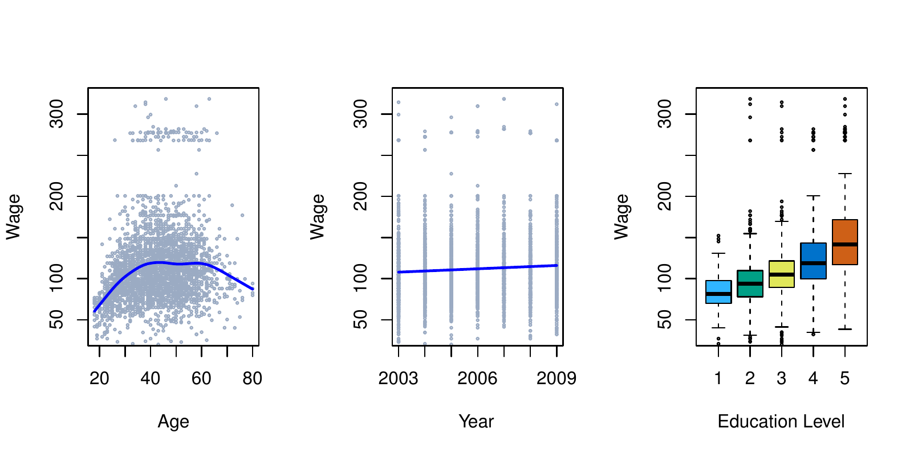
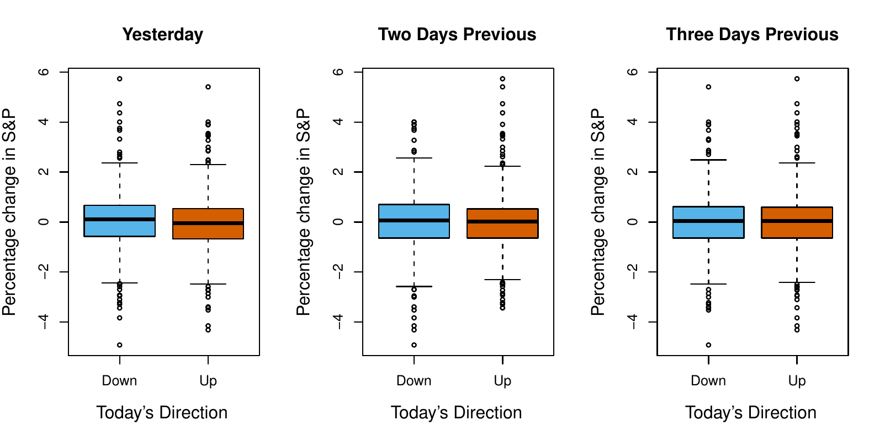
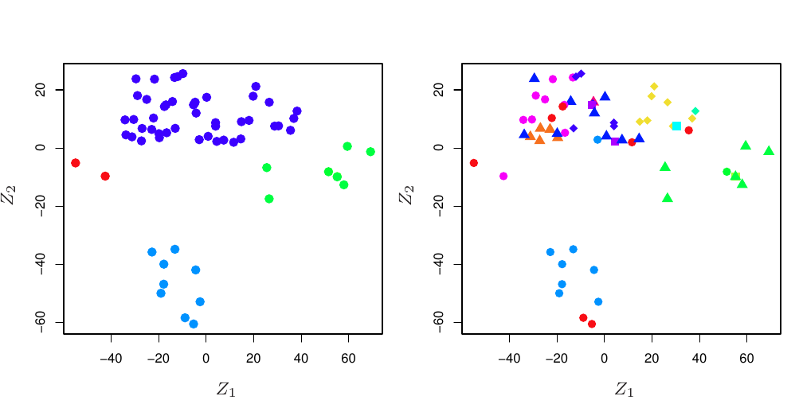
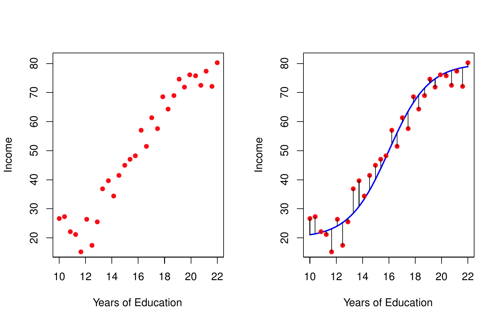
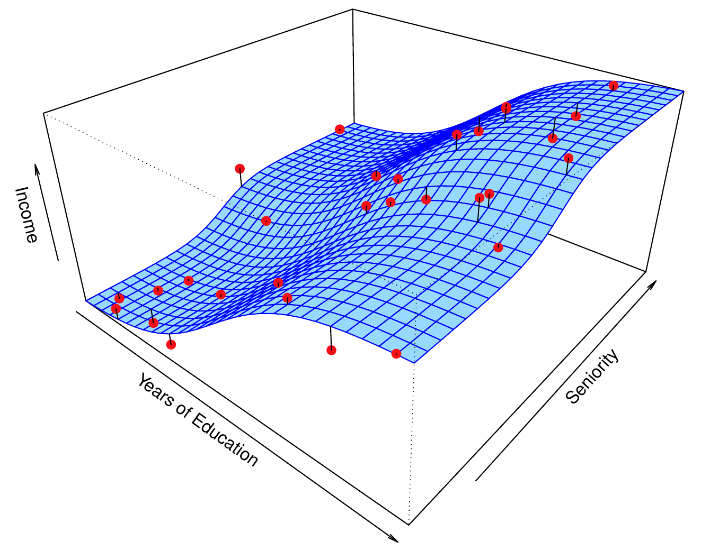
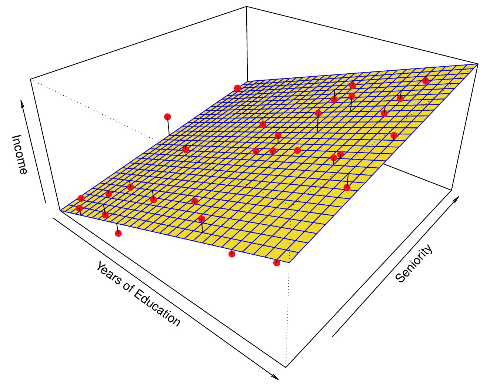
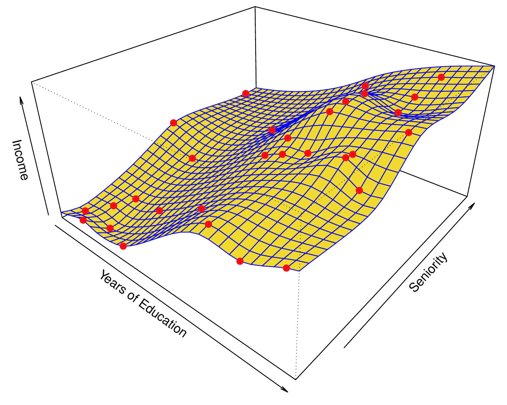
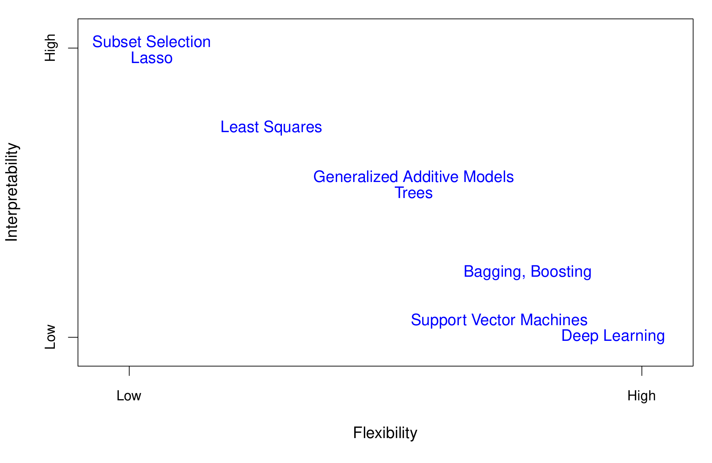

```{python}
#| label: setup
#| include: false
import numpy as np
import pandas as pd
import matplotlib.pyplot as plt
from iterative_latex import iterative_latex
plt.style.use("sta363.mplstyle")
rng = np.random.default_rng(363)
pd.set_option("display.max_columns", 12)
pd.set_option("display.width", 100)
```

## Outline

::: {.incremental}
* Supervised learning  
* Notation  
* Reducible and irreducible error  
* Flexibility and interpretability  
:::

# Supervised learning {.center}

## Supervised learning

::: {.takeaway}
Given predictors we can measure, estimate a response we cannot.
:::

::: {.fragment}
::: {.nonincremental}
* Labs today $\rightarrow$ readmission within 30 days  
* Square footage, age, zip $\rightarrow$ sale price  
* Yesterday's returns $\rightarrow$ tomorrow's direction  
:::
:::

## Wage data

{fig-align="center" width="88%"}

::: {.source}
ISLP Figure 1.1. Wage against age, year, and education for 3,000 men in the
Atlantic region.
:::

## Smarket data

{fig-align="center" width="88%"}

::: {.source}
ISLP Figure 1.2. Previous days' percentage change in the S&P 500, split by
whether the market rose or fell the next day.
:::

::: {.fragment}
::: {.question}
These boxplots look nearly identical. Is this a useless data set?
:::
:::

## NCI60 data

{fig-align="center" width="70%"}

::: {.source}
ISLP Figure 1.4. Sixty four cancer cell lines, 6,830 gene expression
measurements each, summarized into two dimensions.
:::

# Notation {.center}

## Response and predictors {.small}

::: {.definition}
$Y$ is the **response**, also called the outcome or target.

$X = (X_1, X_2, \dots, X_p)$ are the **predictors**, also called features.

$n$ is the number of observations and $p$ the number of predictors.
:::

::: {.fragment}
::: {.question}
In the `Wage` data, what is $Y$? What is $p$?
:::
:::

## Notation in code {.small}

```{python}
DATA = "https://raw.githubusercontent.com/LucyMcGowan/sta-363-f26/main/data/"  # <1>

Wage = pd.read_csv(DATA + "Wage.csv")  # <2>
Wage[["age", "year", "education", "wage"]].head()  # <3>
```
1. `DATA` is the base URL for the raw CSV files in the course's GitHub
   repository. Every data set we load starts by appending a file name to
   this string.
2. `pd.read_csv` reads the CSV at `DATA + "Wage.csv"` over the network and
   returns a `DataFrame`, assigned to `Wage`.
3. `Wage[["age", "year", "education", "wage"]]` selects four columns by
   name, and `.head()` returns the first five rows of that subset for
   display.

::: {.fragment}
```{python}
Wage.shape
```
:::

```{python}
#| output: asis
#| echo: false
iterative_latex(
    "The model",
    r"Y = f(X) + \varepsilon",
    highlights=["Y", "f(X)", r"\varepsilon"],
    explanations=[
        "The response we want to predict.",
        "The true, otherwise-unknown relationship between the predictors and $Y$.",
        "The error term: everything about $Y$ that $X$ does not capture.",
    ],
)
```

## The error term

{fig-align="center" width="84%"}

::: {.source}
ISLP Figure 2.2. Left: observed income and years of education for 30 people.
Right: the true $f$ in blue, with the black segments showing each $\varepsilon_i$.
:::

# Prediction and inference {.center}

## Prediction and inference

:::: {.columns}

::: {.column width="50%"}
### Prediction

Is $\hat{Y}$ close to $Y$?

$\hat{f}$ may be a black box.

::: {.fragment .fade-in}
::: {.takeaway}
**This course.**
:::
:::
:::

::: {.column width="50%"}
### Inference

How does $Y$ change with $X_j$?

$\hat{f}$ must be interpretable.

::: {.fragment .fade-in}
::: {.dim}
STA 112 and STA 312.
:::
:::
:::

::::

```{python}
#| output: asis
#| echo: false
iterative_latex(
    "Reducible and irreducible error",
    r"E\left(Y - \hat{Y}\right)^2 = \underbrace{\left[f(X) - \hat{f}(X)\right]^2}_{\text{reducible}} + \underbrace{\text{Var}(\varepsilon)}_{\text{irreducible}}",
    highlights=[
        r"\left[f(X) - \hat{f}(X)\right]^2",
        r"\text{Var}(\varepsilon)",
    ],
    explanations=[
        "How far our estimate $\\hat{f}$ sits from the truth $f$. A better method or more data can shrink this to zero.",
        "The irreducible error. No method, however good, gets past this floor.",
    ],
)
```


# Flexibility {.center}

## The true f

{fig-align="center" width="54%"}

::: {.source}
ISLP Figure 2.3. Income as a function of education and seniority, simulated so
that the true surface is known.
:::

## Linear fit

{fig-align="center" width="54%"}

::: {.source}
ISLP Figure 2.4. A linear model fit by least squares to the data of Figure 2.3.
:::

## Smoothing spline

{fig-align="center" width="54%"}

::: {.source}
ISLP Figure 2.5. A smooth thin plate spline fit to the same data.
:::

## Overfit spline

{fig-align="center" width="54%"}

::: {.source}
ISLP Figure 2.6. A rough thin plate spline with zero error on the training data.
:::

::: {.fragment}
::: {.question}
Is this the best model? The training error is zero!
:::
:::

## Parametric and non-parametric {.small}

:::: {.columns}

::: {.column width="50%"}
### Parametric

Assume a form for $f$, estimate a fixed number of parameters.

$f(X) = \beta_0 + \beta_1 X_1 + \dots + \beta_p X_p$

Wrong if the form is wrong.
:::

::: {.column width="50%"}
### Non-parametric

No assumed form. The data pick the shape.

Flexible, and needs far more data.
:::

::::

## Flexibility and interpretability

{fig-align="center" width="60%"}

::: {.source}
ISLP Figure 2.7. The trade off between flexibility and interpretability across
methods.
:::

## Regression and classification

:::: {.columns}

::: {.column width="50%"}
### Regression

$Y$ is quantitative.

* Wage  
* Price  
* Blood pressure

:::

::: {.column width="50%"}
### Classification

$Y$ is qualitative.

* Readmitted or not  
* Labeling handwritten numbers  
* Which customers will convert?  

:::

::::

::: {.fragment}
::: {.question}
Is predicting a zip code regression or classification?
:::
:::

# Course mechanics {.center}

## Course structure

::: {.incremental}
* Most Wednesdays: a paper check-in at the start of class  
* Most Fridays: a problem set due  
* Three exams: October 9, November 11, and a Final
:::


## Application exercise 1

::: {.takeaway}
Identifying $Y$, $X$, $n$, and $p$, and sorting problems into prediction and
inference.
:::

## Before Friday

::: {.nonincremental}
* Read ISLP Section 2.2.1  
* Have Colab running 
:::

::: {.fragment}
::: {.question}
How would you check whether the overfit spline was any good?
:::
:::
