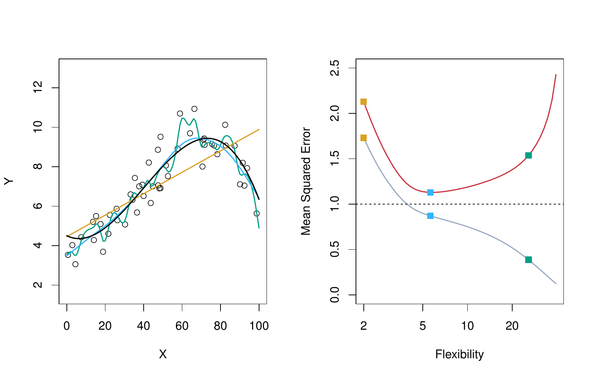
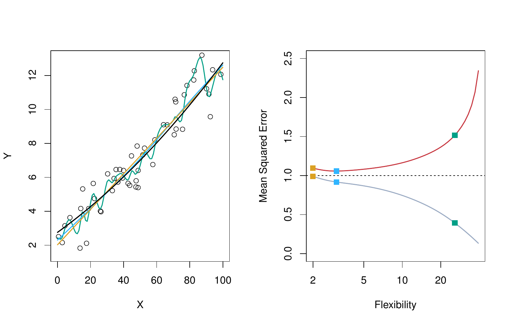
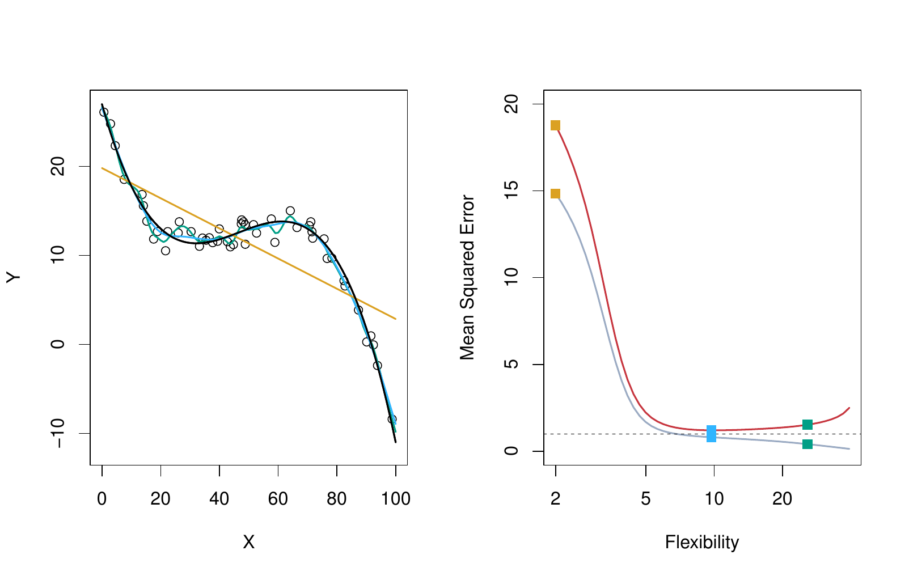

```{python}
#| label: setup
#| include: false
import numpy as np
import pandas as pd
import matplotlib.pyplot as plt
from iterative_latex import iterative_latex
plt.style.use("sta363.mplstyle")
rng = np.random.default_rng(363)
```

## Review

::: {.takeaway}
$$Y = f(X) + \varepsilon$$
:::

::: {.incremental}
* $\hat{f}(X)$ is our best guess at the true $f(X)$  
* Because we cannot observe $f(X)$, we cannot measure $\hat{f}(X)$ against it.  
* We check whether $\hat{f}(X)$ is close to $Y$.  
:::

## Application exercise

::: {.takeaway}
Complete Part 1. [ex/02-ex](../ex/02-ex.qmd)
:::

```{python}
#| output: asis
#| echo: false
iterative_latex(
    "Mean squared error",
    r"\text{MSE} = \frac{1}{n}\sum_{i=1}^{n}\left(y_i - \hat{f}(x_i)\right)^2",
    highlights=[
        r"\left(y_i - \hat{f}(x_i)\right)^2",
        r"\sum_{i=1}^{n}",
        r"\frac{1}{n}",
    ],
    explanations=[
        "The squared prediction error for observation $i$: how far $\\hat{f}(x_i)$ misses $y_i$.",
        "Add that squared error up over every one of the $n$ observations.",
        "Divide by $n$ to turn the total into an average.",
    ],
)
```

## Training MSE and test MSE {.small}

:::: {.columns}

::: {.column width="50%"}
### Training MSE

Computed on the observations used to fit the model.
:::

::: {.column width="50%"}
### Test MSE

Computed on observations the model has never seen.
:::

::::

::: {.fragment}
::: {.question}
Which is smaller, and why?
:::
:::

## Training MSE is usually smaller

::: {.takeaway}
Most methods choose their parameters to minimize training MSE, so we expect training MSE to fall below test MSE.
:::

::: {.fragment}
::: {.question}
What does a small training MSE tell us?
:::
:::


## Flexibility and training MSE

::: {.takeaway}
Training MSE always decreases as flexibility increases.

Test MSE does not (necessarily)
:::


## Degrees of freedom {.small}

::: {.definition}
A single number summarizing how flexible a fitted curve is. A smoother, more restricted curve has fewer degrees of freedom than a wiggly one.
:::

::: {.fragment}
::: {.nonincremental}
* Linear regression with one predictor: 2 degrees of freedom, the most restrictive  
* A very wiggly spline: many more  
:::
:::

# Training and test MSE {.center}

## Non-linear f

{fig-align="center" width="88%"}

::: {.source}
ISLP Figure 2.9. Left: true $f$ in black with three fits. Right: training MSE in
grey, test MSE in red, and $\text{Var}(\varepsilon)$ as the dashed line.
:::

## Overfitting {.small}

::: {.incremental}
* Left of the minimum, the model is too rigid to capture $f$  
* Right of the minimum, the model is fitting $\varepsilon$  
* The dashed floor is $\text{Var}(\varepsilon)$  
:::

::: {.fragment}
::: {.definition}
**Overfitting**: a less flexible model would have had smaller test MSE.
:::
:::

## Near-linear f

{fig-align="center" width="88%"}

::: {.source}
ISLP Figure 2.10. The same setup with a true $f$ that is close to linear.
:::

## Highly non-linear f

{fig-align="center" width="88%"}

::: {.source}
ISLP Figure 2.11. The same setup with a true $f$ that is far from linear.
:::


# In Python {.center}

## Simulated data

```{python}
def f(x):
    return np.sin(2 * x) + 0.3 * x**2  # <1>

x = rng.uniform(-3, 3, 200)  # <2>
y = f(x) + rng.normal(0, 0.6, 200)  # <3>
```
1. `f` is the true, otherwise-unknown regression function: `np.sin(2 * x) +  
   0.3 * x**2`, combining a sine wave with a quadratic term.
2. `rng.uniform(-3, 3, 200)` draws 200 values from a uniform distribution on  
   the interval [-3, 3], assigned to `x`.
3. `y` evaluates `f(x)` and adds `rng.normal(0, 0.6, 200)`, 200 draws of  
   mean zero Gaussian noise with standard deviation 0.6: $Y = f(X) +
   \varepsilon$ in code.

## Interpolating the training data {.small}

```{python}
#| echo: false
#| fig-align: center
x_small = rng.uniform(-3, 3, 12)
y_small = f(x_small) + rng.normal(0, 0.6, 12)
order = np.argsort(x_small)

fig, ax = plt.subplots(figsize=(6.4, 3.6))
ax.plot(x_small[order], y_small[order], "-o", color="#d5008f")
ax.set_xlabel("x")
ax.set_ylabel("y")
plt.show()
```

::: {.fragment}
::: {.question}
The curve touches every training point. What is the training MSE?
:::
:::

## A fresh sample {.small}

```{python}
#| echo: false
#| fig-align: center
x_new = rng.uniform(-3, 3, 12)
y_new = f(x_new) + rng.normal(0, 0.6, 12)

fig, ax = plt.subplots(figsize=(6.4, 3.6))
ax.plot(x_small[order], y_small[order], "-", color="#d5008f", lw=1.6, label="fit")
ax.scatter(x_new, y_new, color="#595959", s=28, label="fresh sample")
ax.set_xlabel("x")
ax.set_ylabel("y")
ax.legend()
plt.show()
```

::: {.fragment}
::: {.takeaway}
Let's generate another set of 10 points from the same distribution. I'll plot my same prediction ($\hat{f}(X)$) with the new data. My original $\hat{f}$ was overfitting to noise, not $f$.
:::
:::

## Train/test split

```{python}
from sklearn.model_selection import train_test_split  # <1>

x_train, x_test, y_train, y_test = train_test_split(
    x, y, test_size=0.5, random_state=363  # <2>
)
x_train.shape, x_test.shape
```
1. `train_test_split` is scikit-learn's function for randomly partitioning  
   arrays into training and test subsets.
2. Called on `x` and `y`. `test_size=0.5` holds out half of the 200  
   observations for testing, and `random_state=363` fixes the shuffle so
   the split is identical every time the deck renders. The four returned
   arrays are unpacked into `x_train`, `x_test`, `y_train`, `y_test`.

## Application exercise

::: {.takeaway}
Complete Part 2. [ex/02-ex](../ex/02-ex.qmd)
:::

## Spline fits {.small}

```{python}
from sklearn.preprocessing import SplineTransformer  # <1>
from sklearn.linear_model import LinearRegression
from sklearn.pipeline import make_pipeline
from sklearn.metrics import mean_squared_error

dfs = range(4, 51, 4)  # <2>
train_mse, test_mse = [], []

for df in dfs:
    model = make_pipeline(SplineTransformer(degree=3, n_knots=df - 2), LinearRegression())  # <3>
    model.fit(x_train.reshape(-1, 1), y_train)  # <4>
    train_mse.append(mean_squared_error(y_train, model.predict(x_train.reshape(-1, 1))))  # <5>
    test_mse.append(mean_squared_error(y_test, model.predict(x_test.reshape(-1, 1))))
```
1. `SplineTransformer` builds a B-spline basis expansion of a predictor,  
   the tool used here for a flexible, well-conditioned curve.
2. `dfs = range(4, 51, 4)` is the sequence of degrees of freedom to sweep:  
   4, 8, 12, ..., 48, from rigid to wiggly.
3. `make_pipeline` chains two steps. `SplineTransformer(degree=3,  
   n_knots=df - 2)` builds a cubic (`degree=3`) spline basis with `df - 2`
   interior knots, giving the basis `df` total degrees of freedom.
   `LinearRegression()` then fits ordinary least squares on that basis.
4. `model.fit(x_train.reshape(-1, 1), y_train)` fits the pipeline on the  
   training data only; `.reshape(-1, 1)` turns the 1-D array `x_train` into
   the 2-D shape scikit-learn expects.
5. `mean_squared_error(y_train, model.predict(...))` computes the training  
   MSE at this `df` and appends it to `train_mse`; the same pattern on the
   next line (not separately annotated) computes the test MSE into
   `test_mse`.

## The test MSE curve {.small}

```{python}
#| echo: false
#| fig-align: center
fig, ax = plt.subplots(figsize=(7.2, 3.6))
ax.plot(dfs, train_mse, "-o", color="#595959", label="Training MSE")
ax.plot(dfs, test_mse, "-o", color="#d5008f", label="Test MSE")
ax.axhline(0.6**2, ls="--", color="#007c86", lw=1.6, label="Var($\\varepsilon$)")
ax.set_xlabel("Degrees of freedom")
ax.set_ylabel("MSE")
ax.set_ylim(0, 1.6)
ax.legend()
plt.show()
```

::: {.fragment}
::: {.question}
Which df would training MSE have chosen?
:::
:::

## Application exercise

::: {.takeaway}
Complete Parts 3-4. [ex/02-ex](../ex/02-ex.qmd)
:::

## The validation set approach

::: {.incremental}
1. Split the data  
2. Fit on the training set  
3. Evaluate on the test set  
4. Keep the model with the smallest test error  
:::

::: {.fragment}
::: {.question}
What could go wrong with step 1?
:::
:::

## Application exercise

::: {.takeaway}
Complete Part 5. [ex/02-ex](../ex/02-ex.qmd)
:::

## Toward cross-validation

::: {.takeaway}
A different split can give a different answer.
:::

::: {.fragment}
::: {.question}
How would you get a more stable answer than a single split?
:::
:::

## Application exercise 2

::: {.takeaway}
Split `Auto`, compared training and test MSE across spline degrees of
freedom, and checked how much the answer moved across random splits.
:::

## Before Wednesday

::: {.nonincremental}
* Read ISLP Section 2.2.2  
* Problem set 1 posted, due Friday September 4  
* Check-in 1 at the start of class  
:::
