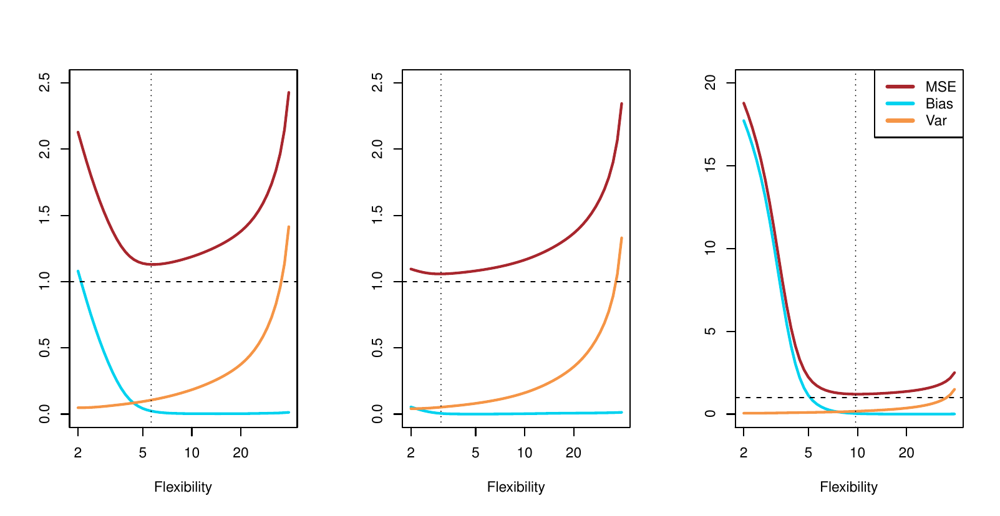

```{python}
#| label: setup
#| include: false
import numpy as np
import pandas as pd
import matplotlib.pyplot as plt
from sklearn.preprocessing import SplineTransformer
from sklearn.linear_model import LinearRegression
from sklearn.pipeline import make_pipeline
from iterative_latex import iterative_latex
plt.style.use("sta363.mplstyle")
rng = np.random.default_rng(363)
```

## Review

::: {.question}
Why is the test MSE curve U-shaped?
:::

```{python}
#| output: asis
#| echo: false
iterative_latex(
    "Bias-variance decomposition",
    r"E\left(y_0 - \hat{f}(x_0)\right)^2 = \text{Var}\left(\hat{f}(x_0)\right) + \left[\text{Bias}\left(\hat{f}(x_0)\right)\right]^2 + \text{Var}(\varepsilon)",
    small=True,
    highlights=[
        r"\text{Var}\left(\hat{f}(x_0)\right)",
        r"\left[\text{Bias}\left(\hat{f}(x_0)\right)\right]^2",
        r"\text{Var}(\varepsilon)",
    ],
    explanations=[
        "How much $\\hat{f}(x_0)$ moves across different training sets.",
        "How far the average $\\hat{f}(x_0)$, over those training sets, sits from the truth $f(x_0)$.",
        "The irreducible error. Neither variance nor bias touches this term.",
    ],
)
```

# Bias and variance {.center}

## Variance, defined

::: {.definition}
How much $\hat{f}$ would change if estimated from a different training
set. Different training data gives a different $\hat{f}$; a good method
should not move too much between them.
:::

## Why flexible methods have high variance

::: {.takeaway}
A flexible fit follows the training points closely, so changing even a few
of those points can change the fit a lot.
:::

::: {.fragment}
::: {.question}
An inflexible line barely moves when one point changes. Why?
:::
:::

## Bias, defined

::: {.definition}
The error from approximating a complicated relationship with a simpler
model. A method that cannot bend enough to match $f$ is biased, no matter
how much data it sees.
:::

```{python}
#| output: asis
#| echo: false
iterative_latex(
    "The bias formula",
    r"\text{Bias}(\hat{f}(x_0)) = E[\hat{f}(x_0)] - f(x_0)",
    highlights=[r"E[\hat{f}(x_0)]", r"f(x_0)"],
    explanations=[
        "The average fit at $x_0$, over many training sets.",
        "The truth at $x_0$. Bias is the gap between the two.",
    ],
)
```

## Variance, illustrated {.small}

```{python}
#| echo: false
#| fig-align: center
def f(x):
    return np.sin(x) + 0.5

grid = np.linspace(-3, 3, 200).reshape(-1, 1)
fig, axes = plt.subplots(1, 2, figsize=(9.2, 3.5), sharey=True)

for df, ax in zip([4, 20], axes):
    for _ in range(25):
        xs = rng.uniform(-3, 3, 60)
        ys = f(xs) + rng.normal(0, 0.6, 60)
        m = make_pipeline(SplineTransformer(degree=3, n_knots=df - 2), LinearRegression())
        m.fit(xs.reshape(-1, 1), ys)
        ax.plot(grid, m.predict(grid), color="#d5008f", alpha=0.22, lw=1.2)
    ax.plot(grid, f(grid.ravel()), color="#595959", lw=2.6)
    ax.set_title(f"df {df}")
    ax.set_ylim(-3, 6)
    ax.set_xlabel("x")
plt.show()
```

::: {.source}
Twenty five fits, each on its own training sample of 60 points. Grey is the true
$f$.
:::

## Bias, illustrated {.small}

```{python}
#| echo: false
#| fig-align: center
fig, axes = plt.subplots(1, 2, figsize=(9.2, 3.5), sharey=True)

for df, ax in zip([4, 20], axes):
    preds = []
    for _ in range(200):
        xs = rng.uniform(-3, 3, 60)
        ys = f(xs) + rng.normal(0, 0.6, 60)
        m = make_pipeline(SplineTransformer(degree=3, n_knots=df - 2), LinearRegression())
        m.fit(xs.reshape(-1, 1), ys)
        preds.append(m.predict(grid))
    mean_pred = np.mean(preds, axis=0)
    ax.plot(grid, f(grid.ravel()), color="#595959", lw=2.6, label="true f")
    ax.plot(grid, mean_pred, color="#d5008f", lw=2.6, ls="--", label="average fit")
    ax.set_title(f"df {df}")
    ax.set_ylim(-3, 6)
    ax.set_xlabel("x")
axes[0].legend(fontsize=7)
plt.show()
```

::: {.source}
The average fit over 200 refits (dashed), against the true $f$ (solid).
:::

::: {.fragment}
::: {.question}
Which average curve is closer to the truth: df 4 or df 20?
:::
:::

## The two extremes {.small}

```{python}
#| echo: false
#| fig-align: center
x_small = rng.uniform(-3, 3, 12)
y_small = f(x_small) + rng.normal(0, 0.6, 12)
order = np.argsort(x_small)

fig, axes = plt.subplots(1, 2, figsize=(9.2, 3.6), sharey=True)
axes[0].scatter(x_small, y_small, color="#595959", s=28)
axes[0].axhline(y_small.mean(), color="#d5008f", lw=2.2)
axes[0].set_title("a flat line")
axes[1].scatter(x_small, y_small, color="#595959", s=28)
axes[1].plot(x_small[order], y_small[order], color="#d5008f", lw=1.8)
axes[1].set_title("connect the dots")
for ax in axes:
    ax.set_xlabel("x")
plt.show()
```

::: {.source}
Twelve points from the same simulation. A flat line on the left, a curve
through every point on the right.
:::

::: {.fragment}
::: {.question}
Which curve has zero training error? Is that the same as being unbiased?
:::
:::

## The extremes, repeated {.small}

```{python}
#| echo: false
#| fig-align: center
fig, axes = plt.subplots(1, 2, figsize=(9.2, 3.6), sharey=True)
xs = rng.uniform(-3, 3, 20)
ordr = np.argsort(xs)
for _ in range(15):
    ys = f(xs) + rng.normal(0, 0.2, 20)
    axes[0].axhline(ys.mean(), color="#d5008f", alpha=0.3, lw=1.4)
    axes[1].plot(xs[ordr], ys[ordr], color="#d5008f", alpha=0.3, lw=1.2)
for ax in axes:
    ax.plot(grid, f(grid.ravel()), color="#595959", lw=2.2)
    ax.set_xlabel("x")
    ax.set_ylim(-4, 7)
axes[0].set_title("a flat line: barely moves")
axes[1].set_title("connect the dots: never the same twice")
plt.show()
```

::: {.source}
Fifteen resamples of twelve points each, same two methods. Grey is the
true $f$.
:::

::: {.fragment}
::: {.takeaway}
The flat lines barely move: low variance, high bias. The interpolators
never agree: low bias, high variance.
:::
:::

## Application exercise 3, part 1 {.small}

Four analysts fit models to the same 200 observations. Each then refits on
50 fresh samples from the same population and plots all 50 fitted curves.

::: {.question}
Match each description to a diagnosis: **high bias, low variance**; **low
bias, high variance**; **high bias, high variance**; **low bias, low
variance**.

**A.** The 50 curves lie almost on top of each other and all miss the same
bend in the data.

**B.** The 50 curves fan out wildly at the edges but their average tracks
the data closely.

**C.** The 50 curves lie almost on top of each other and follow the data
closely.

**D.** The 50 curves fan out wildly and their average still misses the
bend.
:::


# The trade-off {.center}

## More flexible, less flexible

:::: {.columns}

::: {.column width="50%"}
### More flexible

Bias $\downarrow$

Variance $\uparrow$
:::

::: {.column width="50%"}
### Less flexible

Bias $\uparrow$

Variance $\downarrow$
:::

::::

::: {.fragment}
::: {.takeaway}
Choosing flexibility using test error is a bias-variance trade-off.
:::
:::

## Why the curve is U-shaped {.small}

::: {.incremental}
* Bias falls as flexibility increases  
* Variance increases as flexibility increases
* Past some point, more flexibility barely reduces bias but raises variance a lot  
:::


## Bias and variance by data set

{fig-align="center" width="90%"}

::: {.source}
ISLP Figure 2.12. Squared bias in blue, variance in orange, $\text{Var}(\varepsilon)$
dashed, and test MSE in red, for the data of Figures 2.9 to 2.11.
:::

## Bias and variance: moderate curve {.small}

{fig-align="center" width="90%"}

::: {.source}
ISLP Figure 2.12, left panel. The data of Figure 2.9: a moderately
non-linear $f$.
:::

::: {.fragment}
::: {.takeaway}
Bias drops fast as flexibility rises. The minimum sits in the middle.
:::
:::

## Bias and variance: near-linear {.small}

{fig-align="center" width="90%"}

::: {.source}
ISLP Figure 2.12, center panel. The data of Figure 2.10: $f$ close to
linear.
:::

::: {.fragment}
::: {.takeaway}
Bias starts low and stays low. Variance dominates almost immediately.
:::
:::

## Bias and variance: highly non-linear {.small}

{fig-align="center" width="90%"}

::: {.source}
ISLP Figure 2.12, right panel. The data of Figure 2.11: $f$ far from
linear.
:::

::: {.fragment}
::: {.takeaway}
Bias stays high until flexibility is high. Variance barely rises.
:::
:::

## Comparing the three panels {.small}

::: {.nonincremental}
* Moderate curve: bias and variance trade off at a middle flexibility  
* Near-linear: variance dominates, so the simple method wins  
* Highly non-linear: bias dominates, so the flexible method wins  
:::

::: {.fragment}
::: {.takeaway}
The best flexibility depends on the data. We check the shape first.
:::
:::

## Irreducible error

::: {.takeaway}
Bias and variance can both be driven toward zero with the right model and enough
data. $\text{Var}(\varepsilon)$ cannot.
:::


## Application exercise 3, part 3 {.small}

```{python}
#| echo: false
import numpy as np
import matplotlib.pyplot as plt

flex = np.linspace(1, 20, 60)
fig, axes = plt.subplots(1, 3, figsize=(11, 3.2), sharex=True)
curves = {
    "A": 1.0 + 18 * np.exp(-0.55 * flex) + 0.004 * flex**2.1,
    "B": 1.0 + 0.6 * np.exp(-1.6 * flex) + 0.020 * flex**2.0,
    "C": 1.0 + 26 * np.exp(-0.13 * flex) + 0.002 * flex**2.0,
}
for (name, c), ax in zip(curves.items(), axes):
    ax.plot(flex, c, color="#d5008f", lw=2.4)
    ax.axhline(1.0, ls="--", color="#007c86", lw=1.4)
    ax.set_title(name, color="#595959")
    ax.set_xlabel("flexibility")
    ax.set_ylim(0, 12)
axes[0].set_ylabel("test MSE")
plt.tight_layout()
plt.show()
```

Three test MSE curves. The dashed teal line is $\text{Var}(\varepsilon)$ in
each.

::: {.question}
1. For each panel, roughly where is the best flexibility?  
2. In which panel is the true $f$ closest to linear? How do you know?  
3. In which panel would using a very flexible method be least damaging?  
:::


# Moving the knob {.center}

## Flexibility knobs

::: {.nonincremental}
* Polynomial degree or spline degrees of freedom  
* $K$ in K-nearest neighbors  
* Number of predictors  
* Amount of training data  
:::

## K-nearest neighbors, a preview {.small}

::: {.definition}
To classify or predict at $x_0$, average the $K$ closest training points.
:::

::: {.fragment}
::: {.nonincremental}
* Small $K$: flexible, wiggly, high variance  
* Large $K$: rigid, smooth, high bias  
:::
:::

::: {.fragment}
::: {.dim}
Formal definition Friday.
:::
:::

## More data

::: {.takeaway}
More observations shrink variance. Bias is about the model's form, not how
much data it sees, so it barely moves.
:::

::: {.fragment}
::: {.question}
A degree-14 polynomial trained on 20 points versus 20,000. Which has more
variance?
:::
:::

## Application exercise 3, part 4 {.small}

Two claims about a degree-14 polynomial's variance.

::: {.question}
**Claim A:** It has high variance. That is just a property of degree-14
polynomials.

**Claim B:** It depends on how much data you have.
:::

::: {.fragment}
::: {.question}
Which claim is right, and why? Support your answer by describing an
experiment you could run to settle it.
:::
:::

## Irrelevant predictors

::: {.takeaway}
An irrelevant predictor adds a parameter to estimate without adding
signal. Variance rises. Bias does not fall.
:::

## Averaging models

::: {.takeaway}
Average the predictions of many flexible fits, and the noise that made
each one wobble tends to cancel out.
:::

::: {.fragment}
::: {.question}
Does averaging change the bias of the individual fits?
:::
:::

## Averaging models, illustrated {.small}

```{python}
#| echo: false
#| fig-align: center
fig, axes = plt.subplots(1, 2, figsize=(9.2, 3.5), sharey=True)

preds_single, preds_avg = [], []
for _ in range(15):
    fits = []
    for _ in range(15):
        xs = rng.uniform(-3, 3, 60)
        ys = f(xs) + rng.normal(0, 0.6, 60)
        m = make_pipeline(SplineTransformer(degree=3, n_knots=18), LinearRegression())
        m.fit(xs.reshape(-1, 1), ys)
        fits.append(m.predict(grid))
    preds_single.append(fits[0])
    preds_avg.append(np.mean(fits, axis=0))

for p in preds_single:
    axes[0].plot(grid, p, color="#d5008f", alpha=0.25, lw=1.2)
for p in preds_avg:
    axes[1].plot(grid, p, color="#d5008f", alpha=0.25, lw=1.2)
for ax in axes:
    ax.plot(grid, f(grid.ravel()), color="#595959", lw=2.4)
    ax.set_ylim(-3, 6)
    ax.set_xlabel("x")
axes[0].set_title("one df 20 fit")
axes[1].set_title("average of 15 df 20 fits")
plt.show()
```

::: {.source}
Fifteen draws. Left: one fit each time. Right: the average of fifteen fits
each time. Grey is the true $f$.
:::

::: {.fragment}
::: {.takeaway}
Same bias, far less variance. This is the idea behind an entire unit in
November.
:::
:::

## Application exercise 3, part 2 {.small}

::: {.question}
For each change, say what happens to **bias**, to **variance**, and to
**test MSE**. Test MSE may go either way, if so, say what it depends on.

1. Increasing $K$ in KNN from 5 to 50  
2. Collecting 10 times as many observations, model unchanged  
3. Adding 50 irrelevant predictors  
4. Replacing a degree-2 polynomial with a degree-9 polynomial  
5. Averaging the predictions of 100 different flexible models  
:::

```{python}
#| output: asis
#| echo: false
iterative_latex(
    "Classification error rate",
    r"\text{Error rate} = \frac{1}{n}\sum_{i=1}^{n} I\left(y_i \neq \hat{y}_i\right)",
    highlights=[
        r"I\left(y_i \neq \hat{y}_i\right)",
        r"\sum_{i=1}^{n}",
        r"\frac{1}{n}",
    ],
    explanations=[
        "1 if observation $i$ was misclassified, 0 if it was not.",
        "Count up the misclassifications over all $n$ observations.",
        "Divide by $n$ to turn the count into a rate.",
    ],
)
```

## Bias and variance for classification

::: {.takeaway}
The same trade-off holds: a flexible boundary has low bias and high
variance, a rigid one the reverse. Friday formalizes this with the Bayes
classifier and KNN.
:::

## Application exercise 3, wrap-up

::: {.question}
In one sentence: why is the test MSE curve U-shaped rather than monotone?
:::

## Summary {.small}

::: {.nonincremental}
* Expected test MSE splits into variance, squared bias, and irreducible error  
* More flexibility: bias down, variance up  
* The best flexibility depends on how non-linear the truth is  
* More data lowers variance without changing bias  
:::

## Application exercise 3

::: {.takeaway}
Matched bias-variance patterns to fan plots, moved five knobs, read test
MSE curves, settled a debate about sample size, and answered why the curve
is U-shaped.
:::

## Before Friday

::: {.nonincremental}
* Read ISLP Section 2.2.3  
* Problem set 1 due Friday  
:::

::: {.fragment}
::: {.question}
Bias and variance both require knowing $f$. So how do we choose a model?
:::
:::
