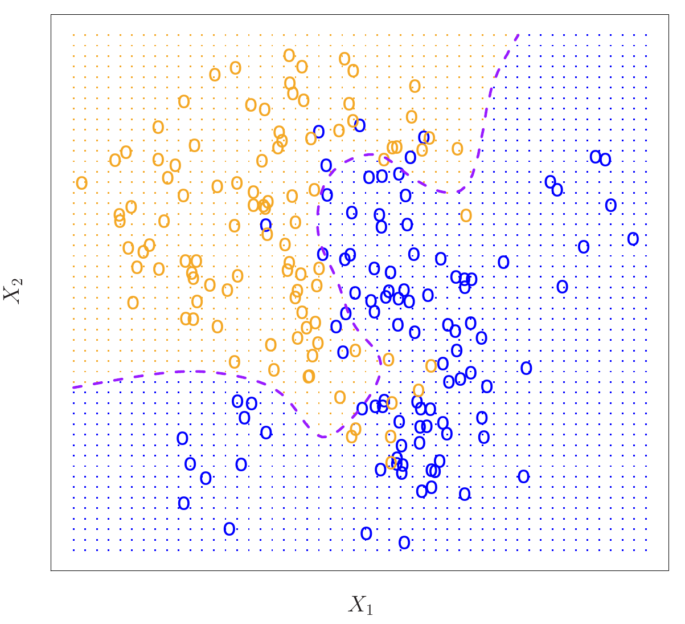
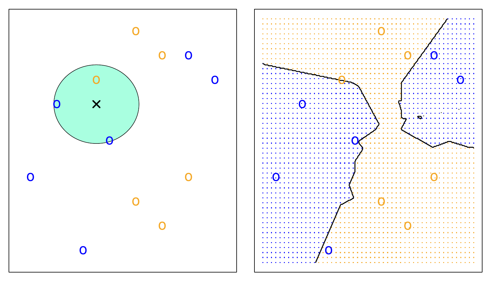
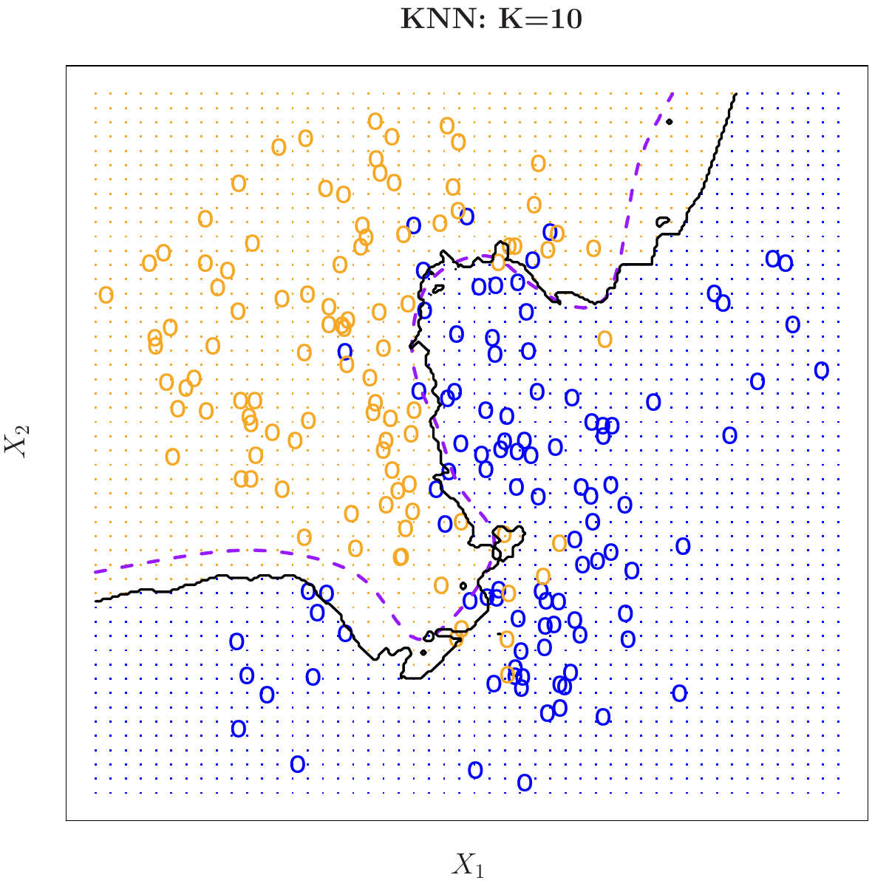
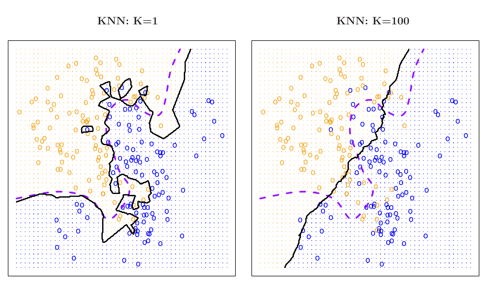
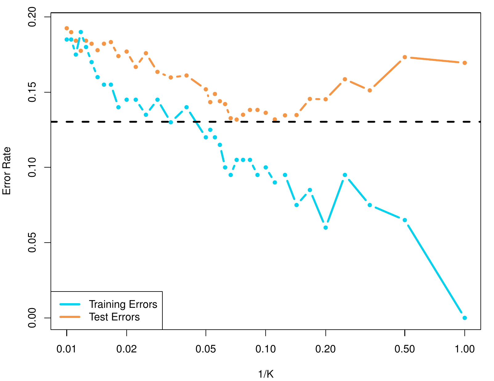

```{python}
#| label: setup
#| include: false
import numpy as np
import pandas as pd
import matplotlib.pyplot as plt
from iterative_latex import iterative_latex
plt.style.use("sta363.mplstyle")
rng = np.random.default_rng(363)
```

## Outline

::: {.incremental}
* The Bayes classifier  
* K-nearest neighbors  
* Flexibility as a tuning parameter  
:::

# The Bayes classifier {.center}

## The Bayes classifier

::: {.definition}
Assign $x_0$ to the class $j$ with the largest
$$\Pr(Y = j \mid X = x_0)$$
:::

::: {.fragment}
::: {.question}
Why can we never use this on real data?
:::
:::

## Bayes decision boundary

{fig-align="center" width="60%"}

::: {.source}
ISLP Figure 2.13. One hundred observations in each of two classes. The purple
dashed line is the Bayes decision boundary. The Bayes error rate is 0.133.
:::

```{python}
#| output: asis
#| echo: false
iterative_latex(
    "Distance",
    r"d(x_0, x_i) = \sqrt{\sum_{j=1}^{p}\left(x_{0j} - x_{ij}\right)^2}",
    highlights=[
        r"x_{0j} - x_{ij}",
        r"\sum_{j=1}^{p}",
    ],
    explanations=[
        "How far apart $x_0$ and a training point $x_i$ are on predictor $j$ alone.",
        "Sum the squared differences across all $p$ predictors, then the square root out front turns that sum into an ordinary Euclidean distance. This is what \"closest\" means below.",
    ],
)
```

## K-nearest neighbors

::: {.definition}
To classify $x_0$, find the $K$ closest training points and take a vote.
:::

```{python}
#| output: asis
#| echo: false
iterative_latex(
    "K-nearest neighbors",
    r"\Pr(Y = j \mid X = x_0) \approx \frac{1}{K}\sum_{i \in \mathcal{N}_0} I(y_i = j)",
    highlights=[
        r"\mathcal{N}_0",
        r"\frac{1}{K}",
        r"I(y_i = j)",
    ],
    explanations=[
        "The $K$ training points closest to $x_0$ by the distance above.",
        "Divide by $K$ so the vote is a proportion rather than a raw count.",
        "1 if neighbor $i$ belongs to class $j$, 0 if it does not.",
    ],
)
```

## KNN with $K = 3$

{fig-align="center" width="70%"}

::: {.source}
ISLP Figure 2.14. Left: the three nearest neighbors of a test point. Right: the
resulting decision boundary.
:::

## KNN with $K = 10$

{fig-align="center" width="58%"}

::: {.source}
ISLP Figure 2.15. KNN with $K = 10$ in black against the Bayes boundary in
purple. Test error is 0.1363 against a Bayes rate of 0.1304.
:::

## KNN with $K = 1$ and $K = 100$

{fig-align="center" width="80%"}

::: {.source}
ISLP Figure 2.16. The same data with $K = 1$ on the left and $K = 100$ on the
right.
:::

::: {.fragment}
::: {.question}
Which is high variance? Which is high bias?
:::
:::

## Training and test error

{fig-align="center" width="52%"}

::: {.source}
ISLP Figure 2.17. KNN training error in blue and test error in orange as $1/K$
increases. The dashed line is the Bayes error rate.
:::

# In Python {.center}

## The Default data {.small}

```{python}
DATA = "https://raw.githubusercontent.com/LucyMcGowan/sta-363-f26/main/data/"  # <1>

Default = pd.read_csv(DATA + "Default.csv")  # <2>
Default.head(4)
```
1. `DATA` is the base URL for the raw CSV files in the course's GitHub
   repository.
2. `pd.read_csv` reads the file at `DATA + "Default.csv"` and returns a
   `DataFrame`, assigned to `Default`.

::: {.fragment}
```{python}
Default["default"].value_counts(normalize=True).round(3)  # <1>
```
1. `Default["default"]` selects the response column. `.value_counts
   (normalize=True)` counts how often each category ("Yes"/"No") appears
   and divides by the total, giving proportions rather than raw counts;
   `.round(3)` rounds those proportions to three decimals for display.
:::

## KNN in scikit-learn {.small}

```{python}
from sklearn.neighbors import KNeighborsClassifier  # <1>
from sklearn.model_selection import train_test_split
from sklearn.preprocessing import StandardScaler
from sklearn.pipeline import make_pipeline

X = Default[["balance", "income"]]  # <2>
y = (Default["default"] == "Yes").astype(int)  # <3>
X_train, X_test, y_train, y_test = train_test_split(
    X, y, test_size=0.3, random_state=363, stratify=y  # <4>
)

ks = [1, 3, 5, 10, 25, 50, 100, 200]  # <5>
train_err, test_err = [], []
for k in ks:
    m = make_pipeline(StandardScaler(), KNeighborsClassifier(n_neighbors=k))  # <6>
    m.fit(X_train, y_train)
    train_err.append(1 - m.score(X_train, y_train))  # <7>
    test_err.append(1 - m.score(X_test, y_test))
```
1. `KNeighborsClassifier` is scikit-learn's K-nearest-neighbors classifier;
   the number of neighbors `K` is set later as `n_neighbors`.
2. `X` selects two columns, `"balance"` and `"income"`, as the predictors.
3. `y` compares `Default["default"]` to the string `"Yes"` element-wise,
   producing `True`/`False`, then `.astype(int)` converts that to 1 (default)
   or 0 (no default).
4. `test_size=0.3` holds out 30% of rows for testing; `random_state=363`
   fixes the shuffle; `stratify=y` forces both the training and test split
   to keep the same proportion of defaults as the full data, since defaults
   are rare.
5. `ks` lists the values of `K` to try, from most flexible (`K=1`) to most
   rigid (`K=200`).
6. `make_pipeline` chains `StandardScaler()`, which centers and scales
   `balance` and `income` to comparable ranges, with `KNeighborsClassifier
   (n_neighbors=k)`; scaling matters here because KNN measures distance
   directly, so an unscaled column with a larger range would dominate.
7. `m.score(X_train, y_train)` returns training accuracy, so `1 -` that
   value is the training error rate, appended to `train_err`.

## Error rate against 1/K {.small}

```{python}
#| echo: false
#| fig-align: center
fig, ax = plt.subplots(figsize=(7.2, 3.5))
inv = [1 / k for k in ks]
ax.plot(inv, train_err, "-o", color="#595959", label="Training error")
ax.plot(inv, test_err, "-o", color="#d5008f", label="Test error")
ax.set_xscale("log")
ax.set_xlabel("1/K")
ax.set_ylabel("Error rate")
ax.legend()
plt.show()
```

::: {.fragment}
::: {.question}
Why is training error at $K = 1$ guaranteed to be zero?
:::
:::

## Curse of dimensionality

::: {.incremental}
* KNN works well when $p$ is small and $n$ is large  
* As $p$ grows, the nearest neighbors stop being near  
* With $p = 20$, capturing 10% of the data needs 80% of every range  
:::

## Application exercise 4

::: {.takeaway}
Tuning $K$, and finding out what happens when you forget to scale.
:::

## Before Wednesday

::: {.nonincremental}
* Read ISLP Sections 5.1.1 to 5.1.3  
* Problem set 1 due today, problem set 2 posted  
* Check-in 2 on Wednesday  
:::

::: {.fragment}
::: {.question}
We picked $K$ by looking at the test set. What is wrong with that?
:::
:::
