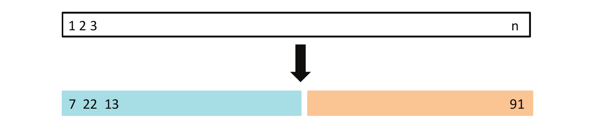
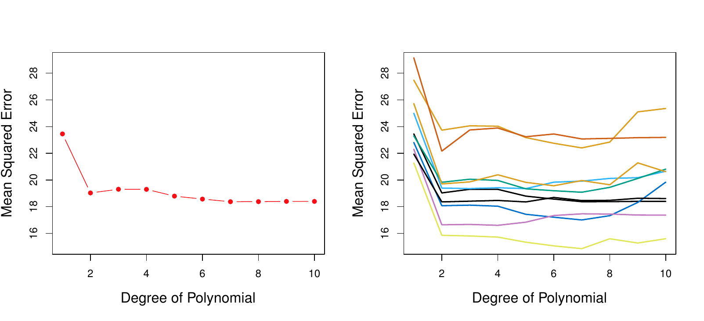
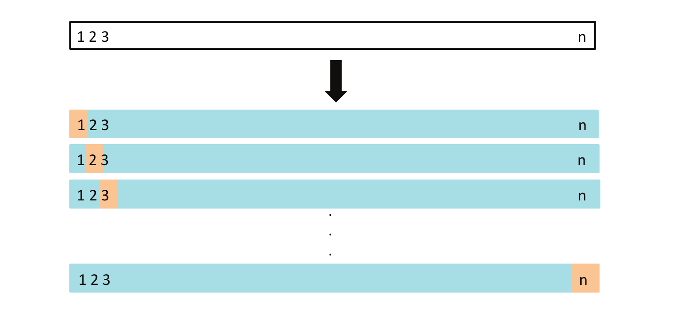
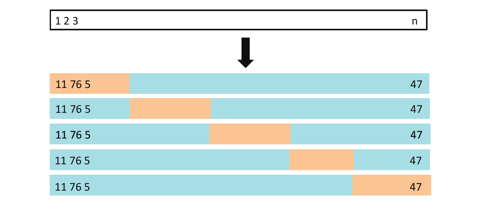
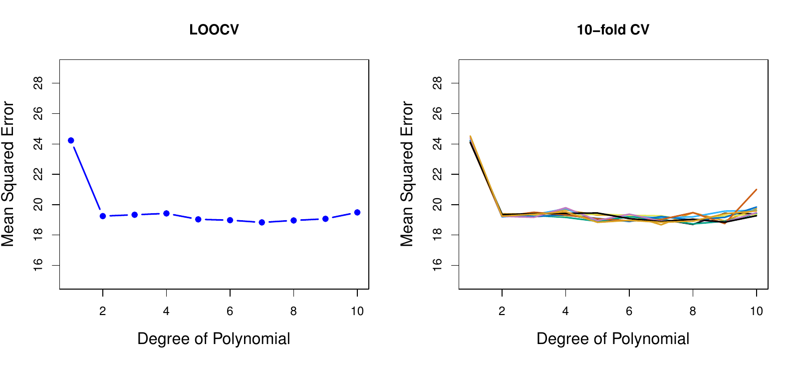
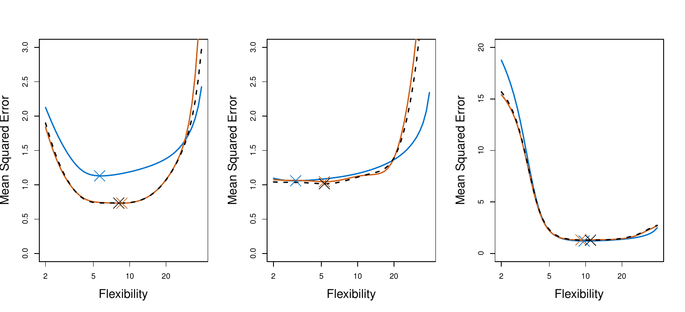

```{python}
#| label: setup
#| include: false
import numpy as np
import pandas as pd
import matplotlib.pyplot as plt
from iterative_latex import iterative_latex
plt.style.use("sta363.mplstyle")
rng = np.random.default_rng(363)
```

## Review

::: {.takeaway}
Test MSE is the quantity we want. One train and test split estimates it noisily, and costs us data.
:::

::: {.fragment}
::: {.question}
You split `Auto` in half on Friday. What happens with a different split?
:::
:::

## The validation set approach

{fig-align="center" width="78%"}

::: {.source}
ISLP Figure 5.1. Observations split at random into a training set in blue and a
validation set in beige.
:::

## Validation set variability

{fig-align="center" width="80%"}

::: {.source}
ISLP Figure 5.2. Predicting `mpg` from polynomials of `horsepower`. Left: one
split. Right: ten different splits.
:::

::: {.fragment}
::: {.question}
Would ten analysts agree on the degree?
:::
:::

## Limitations {.small}

::: {.incremental}
1. The estimate depends heavily on which split was drawn  
2. Fitting on a subset overstates the error of the deployed model  
:::

# LOOCV {.center}

## LOOCV

{fig-align="center" width="76%"}

::: {.source}
ISLP Figure 5.3. Each observation takes a turn as a validation set of size one.
:::

```{python}
#| output: asis
#| echo: false
iterative_latex(
    "LOOCV",
    r"\text{CV}_{(n)} = \frac{1}{n}\sum_{i=1}^{n}\text{MSE}_i",
    highlights=[
        r"\text{MSE}_i",
        r"\sum_{i=1}^{n}",
        r"\frac{1}{n}",
    ],
    explanations=[
        "The MSE from the single fold where observation $i$ was held out and every other observation trained the model.",
        "Add that leave-one-out MSE up over all $n$ observations, since each gets a turn.",
        "Divide by $n$ to average it, exactly like training or test MSE.",
    ],
)
```

## LOOCV looks expensive

::: {.takeaway}
With $n$ observations we fit $n$ models. For regression fit using least squares, there is a shortcut avoids refitting
entirely.
:::

```{python}
#| output: asis
#| echo: false
iterative_latex(
    "The LOOCV shortcut",
    r"\text{CV}_{(n)} = \frac{1}{n}\sum_{i=1}^{n}\left(\frac{y_i - \hat{y}_i}{1 - h_i}\right)^2",
    highlights=[
        r"\hat{y}_i",
        r"h_i",
    ],
    explanations=[
        "The fitted value from the single model fit on all $n$ observations. No refitting.",
        "The leverage of observation $i$: how much that point influences its own fit. Dividing by $1 - h_i$ inflates high-leverage residuals by exactly enough to match what leaving that point out would have given.",
    ],
)
```

::: {.takeaway}
We'll come back to this to define $h_i$ in the linear regression section
:::

## k-fold cross-validation

{fig-align="center" width="78%"}

::: {.source}
ISLP Figure 5.5. Five fold cross-validation. Each fifth takes a turn as the
validation set.
:::

::: {.fragment}
$$\text{CV}_{(k)} = \frac{1}{k}\sum_{j=1}^{k}\text{MSE}_j$$
:::

## LOOCV and 10-fold CV

{fig-align="center" width="84%"}

::: {.source}
ISLP Figure 5.4. Left: the LOOCV error curve on `Auto`. Right: 10-fold CV run
nine times with different random splits.
:::

## CV against true test MSE

{fig-align="center" width="86%"}

::: {.source}
ISLP Figure 5.6. True test MSE in blue, LOOCV as a black dashed line, and
10-fold CV in orange, for the data of Figures 2.9 to 2.11.
:::


## Choosing k: bias {.small}

::: {.incremental}
* LOOCV trains on $n - 1$ points: almost the whole data set, so almost no bias  
* $k$-fold trains on about $(k-1)n/k$ points: fewer, so a little more bias  
* The validation set approach trains on about half: the most bias of the three  
:::

::: {.fragment}
::: {.takeaway}
By bias alone, LOOCV wins.
:::
:::

## Choosing k: variance {.small}

::: {.takeaway}
LOOCV's $n$ fits are trained on nearly identical data, so their errors are
highly correlated. Averaging correlated quantities does not shrink
variance the way averaging independent ones does.
:::

::: {.fragment}
::: {.takeaway}
$k$-fold's fits overlap less, so their errors correlate less, and the
average is more stable. In practice $k = 5$ or $k = 10$ balances both.
:::
:::

# In Python {.center}

## One K, many folds {.small}

```{python}
from sklearn.model_selection import cross_val_score, StratifiedKFold  # <1>
from sklearn.neighbors import KNeighborsClassifier
from sklearn.preprocessing import StandardScaler
from sklearn.pipeline import make_pipeline

DATA = "https://raw.githubusercontent.com/LucyMcGowan/sta-363-f26/main/data/"
Default = pd.read_csv(DATA + "Default.csv")
X = Default[["balance", "income"]]
y = (Default["default"] == "Yes").astype(int)

cv = StratifiedKFold(n_splits=10, shuffle=True, random_state=363)  # <2>
model = make_pipeline(StandardScaler(), KNeighborsClassifier(n_neighbors=25))  # <3>
scores = cross_val_score(model, X, y, cv=cv, scoring="accuracy")  # <4>
scores.round(4)
```
1. `cross_val_score` runs the CV loop; `StratifiedKFold` builds folds that  
   preserve the class balance, which matters here since defaults are rare.
2. 10 folds, shuffled before splitting, with a fixed `random_state` so the  
   fold assignment is reproducible.
3. The same scaled KNN pipeline from Meeting 4, with $K = 25$.  
4. One accuracy score per fold, ten numbers back.  

## Application exercise

::: {.takeaway}
Complete Part 1. [ex/05-ex](../ex/05-ex.qmd)
:::

## Trying different K with cross-validation {.small}

```{python}
ks = [1, 3, 5, 10, 25, 50, 100, 200, 500]
cv_err = []

for k in ks:
    m = make_pipeline(StandardScaler(), KNeighborsClassifier(n_neighbors=k))
    cv_err.append(1 - cross_val_score(m, X, y, cv=cv, scoring="accuracy").mean())

pd.DataFrame({"K": ks, "cv_error": cv_err}).round(4)
```


## Application exercise

::: {.takeaway}
Complete Part 2. [ex/05-ex](../ex/05-ex.qmd)
:::

## Stability across seeds {.small}

```{python}
#| echo: false
#| fig-align: center
fig, ax = plt.subplots(figsize=(7.2, 3.5))
best_ks = []

for seed in range(9):
    cv_s = StratifiedKFold(n_splits=10, shuffle=True, random_state=seed)
    curve = [
        1 - cross_val_score(
            make_pipeline(StandardScaler(), KNeighborsClassifier(n_neighbors=k)),
            X, y, cv=cv_s, scoring="accuracy"
        ).mean()
        for k in ks
    ]
    best_ks.append(ks[int(np.argmin(curve))])
    ax.plot([1 / k for k in ks], curve, color="#d5008f", alpha=0.6)

ax.set_xscale("log")
ax.set_xlabel("1/K")
ax.set_ylabel("10-fold CV error")
plt.show()
```

::: {.source}
Nine runs, each with a different fold assignment. `best_ks` records the
minimizing $K$ from each run.
:::

## Application exercise

::: {.takeaway}
Complete Part 3. [ex/05-ex](../ex/05-ex.qmd)
:::

## cross_val_score for regression {.small}

```{python}
#| output-location: column-fragment
from sklearn.preprocessing import PolynomialFeatures  # <1>
from sklearn.linear_model import LinearRegression
from sklearn.model_selection import KFold

Auto = pd.read_csv(DATA + "Auto.csv")
Xa, ya = Auto[["horsepower"]], Auto["mpg"]

cv_reg = KFold(n_splits=10, shuffle=True, random_state=363)  # <2>
degrees = range(1, 11)
mse = [
    -cross_val_score(
        make_pipeline(StandardScaler(), PolynomialFeatures(d), LinearRegression()),
        Xa, ya, cv=cv_reg, scoring="neg_mean_squared_error"
    ).mean()
    for d in degrees
]  # <3>
pd.DataFrame({"degree": degrees, "cv_mse": mse}).round(2)
```
1. A plain `KFold` replaces `StratifiedKFold`: `mpg` is quantitative, so  
   there is no class balance to preserve.
2. Same 10-fold structure as the previous example, different  
   `cv` object because the target is different.
3. The only change from a single `.fit`/`.score` is wrapping the model in  
   `cross_val_score` and negating, exactly as before.

## Application exercise

::: {.takeaway}
Complete Part 4. [ex/05-ex](../ex/05-ex.qmd)
:::

## Stability of 10-fold CV {.small}

```{python}
#| echo: false
#| fig-align: center
fig, ax = plt.subplots(figsize=(7.2, 3.5))
for r in range(9):
    cv_r = KFold(n_splits=10, shuffle=True, random_state=r)
    curve = [
        -cross_val_score(
            make_pipeline(StandardScaler(), PolynomialFeatures(d), LinearRegression()),
            Xa, ya, cv=cv_r, scoring="neg_mean_squared_error"
        ).mean()
        for d in degrees
    ]
    ax.plot(degrees, curve, color="#d5008f", alpha=0.55, lw=1.5)
ax.set_xlabel("Polynomial degree")
ax.set_ylabel("10-fold CV MSE")
ax.set_ylim(15, 28)
plt.show()
```

::: {.source}
Nine runs of 10-fold CV on `Auto`, differing only in the fold assignment.
Steadier than the nine single-split curves from Friday.
:::

## Application exercise

::: {.takeaway}
Complete Part 5. [ex/05-ex](../ex/05-ex.qmd)
:::

## Application exercise 5

::: {.takeaway}
Ran cross-validation for one K, swept K, checked how stable the choice is
across seeds, repeated the whole exercise for regression, and asked
whether scaling before the split is safe.
:::

## Before Friday

::: {.nonincremental}
* Read ISLP Section 5.1.4  
* Problem set 2 due Friday  
:::
