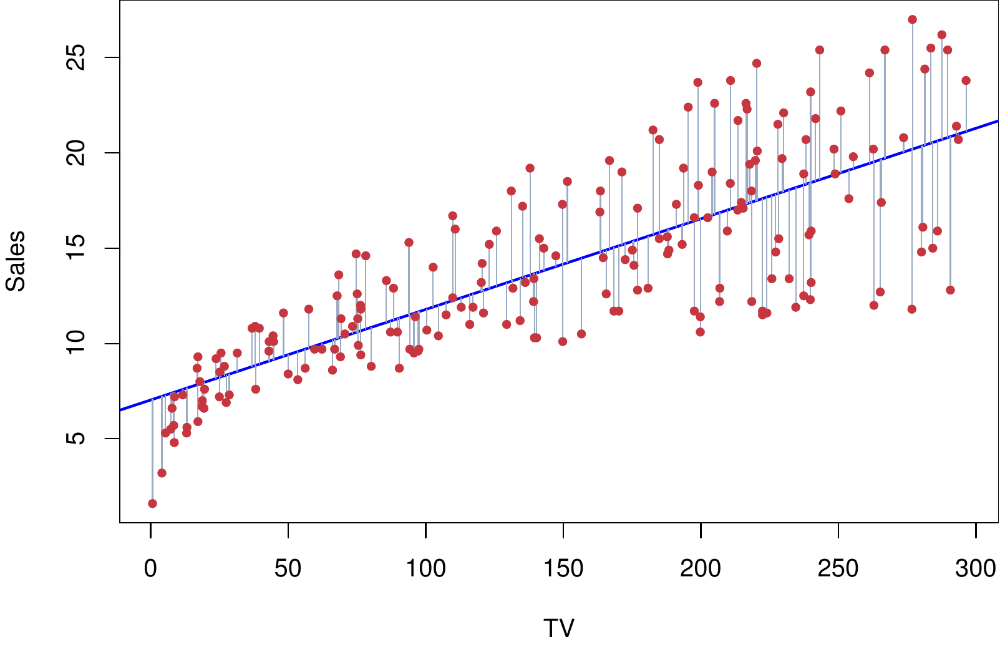
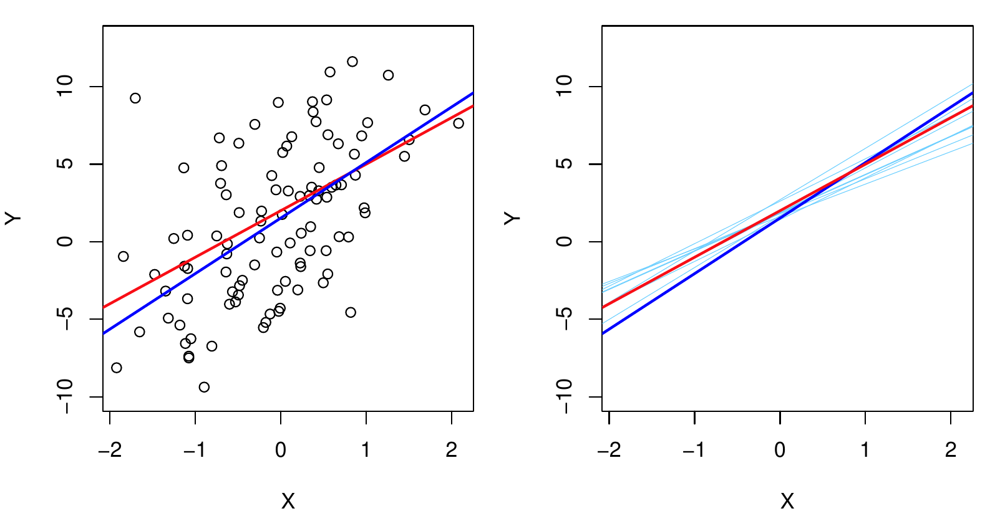
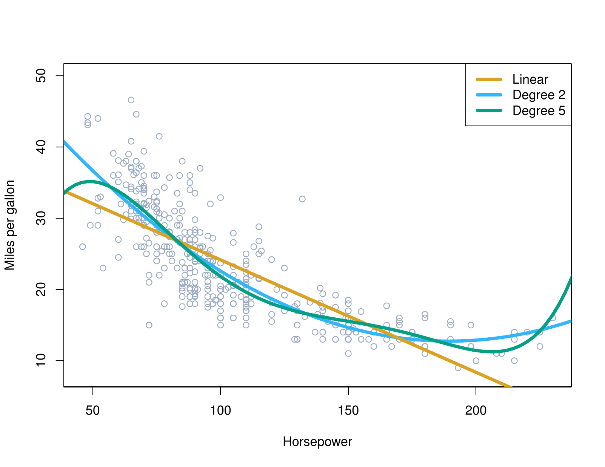

```{python}
#| label: setup
#| include: false
import numpy as np
import pandas as pd
import matplotlib.pyplot as plt
from iterative_latex import iterative_latex
plt.style.use("sta363.mplstyle")
rng = np.random.default_rng(363)
```

## Review

::: {.fragment}
::: {.question}
Everything so far applies to any $\hat{f}$. What have we assumed about the
shape of $\hat{f}$?
:::
:::

# Simple linear regression {.center}

```{python}
#| output: asis
#| echo: false
iterative_latex(
    "Simple linear regression",
    r"Y = \beta_0 + \beta_1 X + \varepsilon",
    highlights=[
        r"\beta_0 + \beta_1 X",
        r"\beta_1",
        r"\beta_0",
        r"\beta_0 + \beta_1 X",
        r"\varepsilon",
    ],
    explanations=[
        "A simple relationship linear between  $X$ and $Y$",
        "$\\beta_1$ is the change in $Y$ associated with a one unit change in $X$",
        "$\\beta_0$ is the value of $Y$ when $X$ is zero.",
        "Without a 'hat' these are properties of the true underlying population, so they are fixed but unknown.",
        "The error term, everything about $Y$ that $X$ does not explain.",
    ],
)
```

## Residuals {.small}

::: {.definition}
The fitted value is $\hat{y} = \hat{\beta}_0 + \hat{\beta}_1 x$, where a hat
means estimated from data. The residual for observation $i$ is
$$\hat{\varepsilon}_i = y_i - \hat{y}_i = y_i - \left(\hat{\beta}_0 + \hat{\beta}_1 x_i\right)$$
:::

::: {.fragment}
::: {.question}
The residual is an estimate of what?
:::
:::

```{python}
#| output: asis
#| echo: false
iterative_latex(
    "Residual sum of squares",
    r"\text{RSS} = \sum_{i=1}^{n}\left(y_i - \hat{\beta}_0 - \hat{\beta}_1 x_i\right)^2",
    highlights=[
        r"\left(y_i - \hat{\beta}_0 - \hat{\beta}_1 x_i\right)^2",
        r"\sum_{i=1}^{n}",
    ],
    explanations=[
        "We square the residual for observation $i$, this means that misses above and below the line count the same and large misses count more than small ones (as this is quadratic).",
        "Add the squared residuals for all $n$ observations. Least squares picks the $\\hat{\\beta}_0$ and $\\hat{\\beta}_1$ that make this total as small as possible.",
    ],
)
```

## Least squares fit

{fig-align="center" width="60%"}

::: {.source}
ISLP Figure 3.1. The least squares fit of `sales` on `TV` for the Advertising
data. Each grey segment is one residual, and the line minimizes the sum of
their squares.
:::

## Estimates and the truth {.small}

{fig-align="center" width="82%"}

::: {.source}
ISLP Figure 3.3. Left: the population regression line in red, the least squares
line in blue. Right: ten least squares lines, each from its own sample.
:::

::: {.fragment}
::: {.question}
Ten samples, ten lines. What is this picture showing?
:::
:::

## Application exercise

::: {.takeaway}
Complete Part 1. [ex/07-ex](../ex/07-ex.qmd)
:::

# Matrix form {.center}

## Stacking the observations {.small}

$$
\begin{bmatrix} Y_1 \\ Y_2 \\ \vdots \\ Y_n \end{bmatrix} =
\begin{bmatrix} 1 & X_1 \\ 1 & X_2 \\ \vdots & \vdots \\ 1 & X_n \end{bmatrix}
\begin{bmatrix} \beta_0 \\ \beta_1 \end{bmatrix} +
\begin{bmatrix} \varepsilon_1 \\ \varepsilon_2 \\ \vdots \\ \varepsilon_n \end{bmatrix}
$$

::: {.fragment}
::: {.question}
What are the dimensions of each of those four pieces?
:::
:::

```{python}
#| output: asis
#| echo: false
iterative_latex(
    "The linear model",
    r"\mathbf{Y} = \mathbf{X}\beta + \varepsilon",
    highlights=[
        r"\mathbf{X}",
        r"\beta",
    ],
    explanations=[
        "The design matrix: $n$ rows, one per observation, and $p + 1$ columns, a leading column of ones for the intercept and one column per predictor.",
        "The vector of $p + 1$ coefficients, the thing being estimated. $\\mathbf{Y}$ on the left is the vector of $n$ responses, so this is the whole model for every observation at once.",
    ],
)
```

# How do we estimate the coefficients?

## Minimize RSS {.small}

$$\text{RSS} = \hat{\varepsilon}^T\hat{\varepsilon} = (\mathbf{y} - \mathbf{X}\hat\beta)^T(\mathbf{y} - \mathbf{X}\hat\beta)$$

::: {.fragment}
$$\frac{\partial \text{RSS}}{\partial \hat\beta} = -2\mathbf{X}^T\mathbf{y} + 2\mathbf{X}^T\mathbf{X}\hat\beta = 0$$
:::

::: {.fragment}
$$\mathbf{X}^T\mathbf{X}\hat\beta = \mathbf{X}^T\mathbf{y}$$
:::

::: {.fragment}
::: {.takeaway}
Multiply both sides by $(\mathbf{X}^T\mathbf{X})^{-1}$ and solve.
:::
:::

```{python}
#| output: asis
#| echo: false
iterative_latex(
    "The least squares estimate",
    r"\hat\beta = (\mathbf{X}^T\mathbf{X})^{-1}\mathbf{X}^T\mathbf{y}",
    highlights=[
        r"(\mathbf{X}^T\mathbf{X})^{-1}",
    ],
    explanations=[
        "$\\mathbf{X}^T\\mathbf{X}$ is a $(p+1) \\times (p+1)$ matrix of sums of products of the predictors with each other, and this is its inverse.",
    ],
)
```

## Application exercise

::: {.takeaway}
Complete Part 2. [ex/07-ex](../ex/07-ex.qmd)
:::

## The hat matrix {.small}

$$\hat{\mathbf{y}} = \mathbf{X}\hat\beta = \underbrace{\mathbf{X}(\mathbf{X}^T\mathbf{X})^{-1}\mathbf{X}^T}_{\mathbf{H}}\mathbf{y}$$

::: {.fragment}
::: {.definition}
$h_i$, the $i$th diagonal entry of $\mathbf{H}$, is the **leverage** of
observation $i$: how much its own $y_i$ contributes to its own $\hat{y}_i$.
It grows with the distance of $x_i$ from $\bar{x}$, and
$\sum_{i=1}^n h_i = p + 1$.
:::
:::

## The LOOCV shortcut {.small}

$$\text{CV}_{(n)} = \frac{1}{n}\sum_{i=1}^{n}\left(\frac{y_i - \hat{y}_i}{1 - h_i}\right)^2$$

::: {.fragment}
::: {.takeaway}
 A high-leverage point pulls its own fit toward itself,
so its ordinary residual understates how badly the model would have missed it.
Dividing by $1 - h_i$ corrects that by exactly the right amount.
:::
:::

## Application exercise

::: {.takeaway}
Complete Part 4. [ex/07-ex](../ex/07-ex.qmd)
:::

# Multiple linear regression {.center}

## Multiple linear regression {.small}

$$Y = \beta_0 + \beta_1X_1 + \beta_2X_2 + \dots + \beta_pX_p + \varepsilon$$

::: {.fragment}
::: {.takeaway}
Nothing changes in matrix form. $\mathbf{X}$ gains columns, $\beta$ gains rows,
and $\hat\beta = (\mathbf{X}^T\mathbf{X})^{-1}\mathbf{X}^T\mathbf{y}$ is the
same formula.
:::
:::

::: {.fragment}
::: {.question}
$\hat\beta_j$ is the change in $Y$ per unit of $X_j$ holding the others fixed.
:::
:::

## Qualitative predictors {.small}

::: {.definition}
A categorical predictor with $k$ levels enters as $k - 1$ indicator columns,
each 0 or 1. The level left out is the baseline (or reference), and every coefficient is interpreted with respect to it.
:::

::: {.fragment}
::: {.takeaway}
`OneHotEncoder(drop="first")` does this.
:::
:::

## Polynomial terms

{fig-align="center" width="58%"}

::: {.source}
ISLP Figure 3.8. `mpg` against `horsepower` in the `Auto` data, with a linear
fit in orange, a quadratic in blue, and a degree five polynomial in green.
:::

::: {.fragment}
::: {.question}
All three are linear models. Linear in what?
:::
:::

# In Python {.center}

## LinearRegression {.small}

```{python}
DATA = "https://raw.githubusercontent.com/LucyMcGowan/sta-363-f26/main/data/"
from sklearn.linear_model import LinearRegression  # <1>

Boston = pd.read_csv(DATA + "Boston.csv")
X = Boston[["lstat", "rm", "ptratio"]]  # <2>
y = Boston["medv"]

fit = LinearRegression().fit(X, y)  # <3>
pd.Series(fit.coef_, index=X.columns).round(3)  # <4>
```
1. `LinearRegression` is scikit-learn's least squares fit. 
2. `X` selects three predictor columns of the `Boston` data and `y` is  
   `medv`, the median home value of a census tract in thousands of dollars.
3. `.fit(X, y)` estimates the coefficients and stores them on the fitted  
   object, assigned to `fit`. An intercept column is added for you, so
   `X` should not contain a column of ones.
4. `fit.coef_` holds the slopes in the order of `X.columns`; wrapping it in  
   `pd.Series` with that index labels them, and the intercept sits separately
   in `fit.intercept_`.

## Cross-validated MSE {.small}

```{python}
from sklearn.model_selection import cross_val_score, KFold
from sklearn.neighbors import KNeighborsRegressor
from sklearn.preprocessing import StandardScaler
from sklearn.pipeline import make_pipeline

MSE = "neg_mean_squared_error"
cv = KFold(n_splits=10, shuffle=True, random_state=363)  # <1>
knn = make_pipeline(StandardScaler(), KNeighborsRegressor(10))  # <2>

lin_mse = -cross_val_score(LinearRegression(), X, y, cv=cv, scoring=MSE).mean()  # <3>
knn_mse = -cross_val_score(knn, X, y, cv=cv, scoring=MSE).mean()
round(float(lin_mse), 2), round(float(knn_mse), 2)
```
1. The same 10-fold structure we've used before, with a fixed `random_state` so  
   both models below see identical folds.
2. The scaled 10-nearest-neighbors pipeline, so both methods  
   are scored on the same folds and the two numbers are comparable.
3. `cross_val_score` with `scoring="neg_mean_squared_error"` returns negative  
   MSE, so the leading minus sign turns it back into MSE, and `.mean()`
   averages over the ten folds. `MSE` is bound to that string once above to
   keep the two calls short enough to read.

::: {.fragment}
::: {.question}
Three predictors in a linear model with 506 observations versus 10-nearest neighbor model. Which method did you expect to win?
:::
:::

## Application exercise

::: {.takeaway}
Complete Parts 3 and 5. [ex/07-ex](../ex/07-ex.qmd)
:::

## Before Friday

::: {.nonincremental}
* Read ISLP Section 6.1  
* Problem set 3 due Friday  
:::


