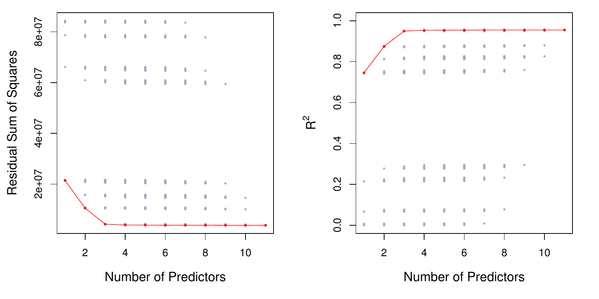
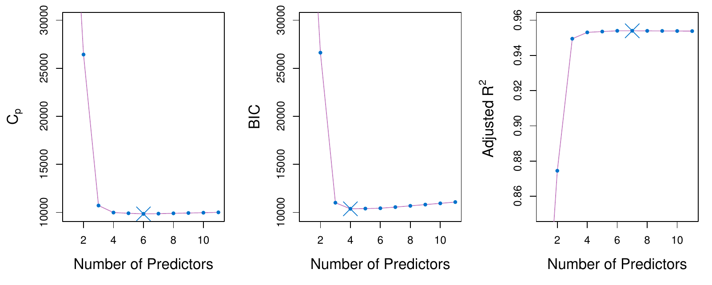
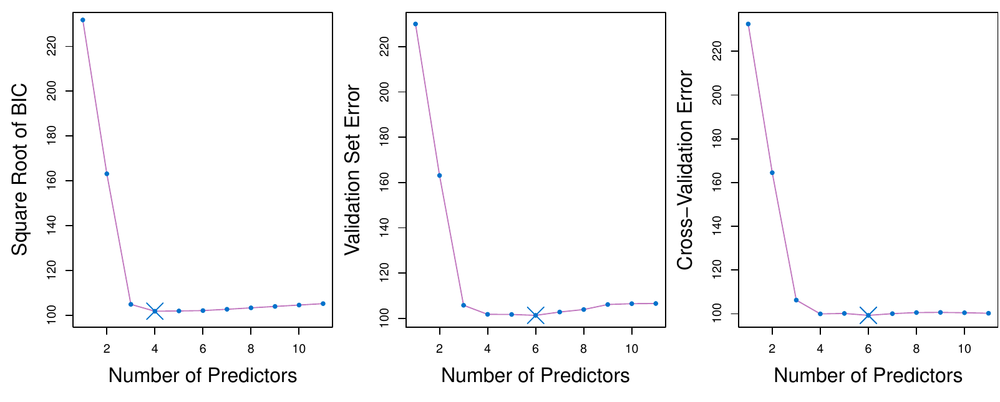

```{python}
#| label: setup
#| include: false
import numpy as np
import pandas as pd
import matplotlib.pyplot as plt
from iterative_latex import iterative_latex
plt.style.use("sta363.mplstyle")
rng = np.random.default_rng(363)
```


## Reasons to drop predictors {.small}

::: {.incremental}
* Feasibility: when $p > n$, $\mathbf{X}^T\mathbf{X}$ has no inverse  
* Interpretability: a model with fewer predictors may be more interpretable
:::


# Best subset selection {.center}

## Best subset selection {.small}

::: {.definition}
Fit every model that uses some subset of the $p$ predictors. For each size $k$,
keep the one with the smallest RSS ($\mathcal{M}_k$). Then choose among
$\mathcal{M}_0, \dots, \mathcal{M}_p$ using estimated test error.
:::


## Every subset on Credit

{fig-align="center" width="66%"}

::: {.source}
ISLP Figure 6.1. RSS and $R^2$ for all $2^{11}$ models on the `Credit` data. 
:::

## Application exercise

::: {.takeaway}
Complete Part 1. [ex/08-ex](../ex/08-ex.qmd)
:::

## Training RSS {.small}

::: {.takeaway}
The size $k$ winner is one of the candidates at size $k + 1$, so the size
$k + 1$ winner can never be worse. RSS falls and $R^2$ rises no matter what
the added predictor is.
:::

::: {.fragment}
::: {.question}
So if we picked by training RSS, which model would we always choose?
:::
:::

## The cost of searching {.small}

::: {.definition}
Best subset selection over $p$ predictors fits $2^p$ models. At $p = 19$ that
is 524,288. At $p = 40$ it is over a trillion.
:::

::: {.fragment}
::: {.takeaway}
The larger the search, the better some model looks by luck alone.
:::
:::

## Application exercise

::: {.takeaway}
Complete Part 2. [ex/08-ex](../ex/08-ex.qmd)
:::


# Estimating test error {.center}

## Two routes to test error {.small}

:::: {.columns}

::: {.column width="50%"}
### Adjust training error

Add a penalty to training RSS that grows with $d$.

$C_p$, AIC, BIC, adjusted $R^2$.
:::

::: {.column width="50%"}
### Estimate it directly

Hold data out and measure (i.e., cross-validation).
:::

::::

```{python}
#| output: asis
#| echo: false
iterative_latex(
    "Mallow's Cp",
    r"C_p = \frac{1}{n}\left(\text{RSS} + 2 d \hat\sigma^2\right)",
    highlights=[
        r"\text{RSS}",
        r"2 d \hat\sigma^2",
        r"\hat\sigma^2",
    ],
    explanations=[
        "Training RSS, which falls every time a predictor is added and so cannot choose a model size on its own.",
        "The penalty. $d$ is the number of predictors in the model, so the penalty grows every time one is added, offsetting the fall in RSS that adding it guarantees.",
        "An estimate of $\\text{Var}(\\varepsilon)$, taken from the model containing all $p$ predictors. Every model on the path is judged against that one number, which is why $C_p$ needs $n > p$ to exist at all.",
    ],
)
```

```{python}
#| output: asis
#| echo: false
iterative_latex(
    "BIC",
    r"\text{BIC} = \frac{1}{n}\left(\text{RSS} + \log(n) d \hat\sigma^2\right)",
    highlights=[
        r"\log(n)",
        r"\log(n) d \hat\sigma^2",
    ],
    explanations=[
        "$\\log(n)$ replaces the 2 in $C_p$. For any $n$ above 7 that is larger than 2, and it keeps growing with the sample size.",
        "The whole penalty is therefore heavier than $C_p$'s, so BIC selects smaller models, and the gap widens as $n$ grows.",
    ],
)
```

```{python}
#| output: asis
#| echo: false
iterative_latex(
    "Adjusted R squared",
    r"\text{Adjusted } R^2 = 1 - \frac{\text{RSS}/(n - d - 1)}{\text{TSS}/(n-1)}",
    highlights=[
        r"\text{RSS}/(n - d - 1)",
        r"\text{TSS}/(n-1)",
    ],
    explanations=[
        "RSS divided by its degrees of freedom rather than by $n$. Adding a useless predictor lowers RSS a little and lowers $n - d - 1$ too, so the ratio can rise, which ordinary $R^2$ can never do.",
        "The total sum of squares $\\sum(y_i - \\bar{y})^2$ over its degrees of freedom, the same denominator for every model on the path. Unlike $C_p$ and BIC this needs no $\\hat\\sigma^2$, and unlike them it is maximized rather than minimized.",
    ],
)
```

## AIC {.small}

::: {.definition}
The Akaike information criterion penalizes the maximized log likelihood by the
number of parameters. For a least squares model with normal errors, AIC is
proportional to $C_p$.
:::


## Three criteria on Credit

{fig-align="center" width="90%"}

::: {.source}
ISLP Figure 6.2. $C_p$, BIC, and adjusted $R^2$ for the best model of each size
on `Credit`. BIC turns up after four variables; the other two stay flat.
:::


## Validation and cross-validation

{fig-align="center" width="84%"}

::: {.source}
ISLP Figure 6.3. Square root of BIC, validation set error, and cross-validation
error for `Credit`. The blue cross marks each one's choice.
:::


## Why cross-validation wins {.small}

::: {.incremental}
* $C_p$ and BIC need $\hat\sigma^2$ from the full model, which needs $n > p$  
* They also assume the errors behave, and cross-validation assumes nothing  
* Cross-validation applies to methods with no clear $d$ at all  
:::


