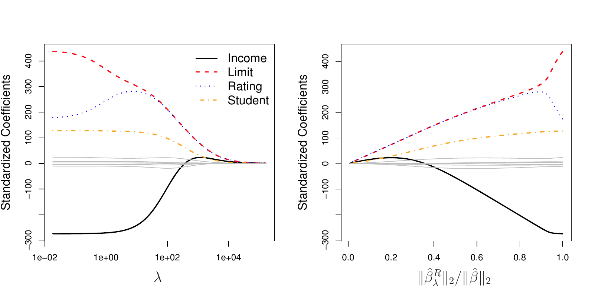
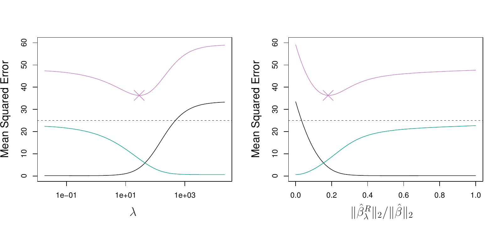
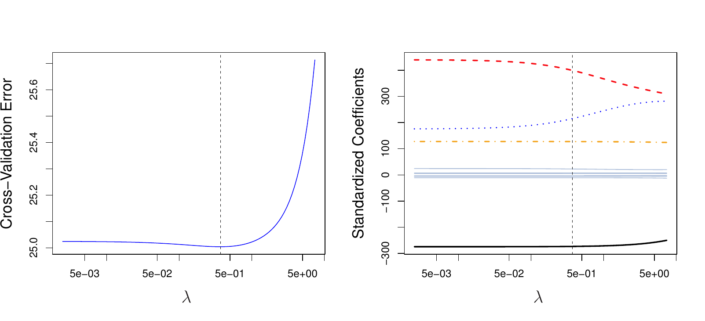

```{python}
#| label: setup
#| include: false
import numpy as np
import pandas as pd
import matplotlib.pyplot as plt
from iterative_latex import iterative_latex
plt.style.use("sta363.mplstyle")
rng = np.random.default_rng(363)
```


# When least squares breaks {.center}

## The least squares estimate {.small}

$$\hat\beta = (\mathbf{X}^T\mathbf{X})^{-1}\mathbf{X}^T\mathbf{y}$$

::: {.fragment}
::: {.question}
Under what circumstances does this not exist?
:::
:::

::: {.fragment}
::: {.nonincremental}
* $p > n$, so $\mathbf{X}^T\mathbf{X}$ has rank at most $n$  
* Some column is a linear combination of the others  
:::
:::

## Determinants {.small}

::: {.definition}
A square matrix is invertible when its determinant is nonzero. For a
two by two matrix,
$$\left|\begin{matrix} a & b \\ c & d \end{matrix}\right| = ad - bc$$
:::

::: {.fragment}
::: {.takeaway}
A matrix that is perfectly collinear has a determinant of zero.
:::
:::

## Near collinearity {.small}

```{python}
X = np.array([[1, 3.01, 6], [1, 4, 8], [1, 5, 10], [1, 2, 4]])  # <1>
y = np.array([1, 2, 3, 2])

float(np.linalg.det(X.T @ X).round(6)), float(np.corrcoef(X[:, 1], X[:, 2])[0, 1].round(6))  # <2>
```
1. Four observations, an intercept column, and two predictors that would be  
   exactly proportional if the first entry were 3 instead of 3.01.
2. `np.linalg.det` is the determinant of $\mathbf{X}^T\mathbf{X}$ and  
   `np.corrcoef(...)[0, 1]` is the correlation between the two predictor
   columns. The determinant is tiny and the correlation is essentially 1.

::: {.fragment}
```{python}
np.linalg.solve(X.T @ X, X.T @ y).round(2)  # <1>
```
1. `np.linalg.solve` returns the least squares coefficients anyway, since the  
   determinant is nonzero. But the values are large! 
:::

## Variance of the estimate {.small}

$$\text{Var}(\hat\beta) = \sigma^2(\mathbf{X}^T\mathbf{X})^{-1}$$

::: {.fragment}
::: {.takeaway}
A determinant near zero means the entries of the inverse are large, so the
variances on its diagonal are large. Refit on a slightly different sample
and $\hat\beta$ moves a lot.
:::
:::

## Application exercise

::: {.takeaway}
Complete Part 1. [ex/09-ex](../ex/09-ex.qmd)
:::

# Ridge regression {.center}

```{python}
#| output: asis
#| echo: false
iterative_latex(
    "Ridge regression",
    r"\sum_{i=1}^{n}\left(y_i - \beta_0 - \sum_{j=1}^{p}\beta_jx_{ij}\right)^2 + \lambda\sum_{j=1}^{p}\beta_j^2",
    small=True,
    highlights=[
        r"\sum_{i=1}^{n}\left(y_i - \beta_0 - \sum_{j=1}^{p}\beta_jx_{ij}\right)^2",
        r"\sum_{j=1}^{p}\beta_j^2",
        r"\lambda",
    ],
    explanations=[
        "Ordinary RSS, the same quantity least squares minimizes on its own.",
        "The shrinkage penalty: the sum of squared coefficients, small when every $\\beta_j$ is near zero. The sum starts at $j = 1$, so the intercept is never penalized.",
        "The tuning parameter, chosen by cross-validation. At $\\lambda = 0$ this is least squares. As $\\lambda \\rightarrow \\infty$ every coefficient goes to zero.",
    ],
)
```

## In matrix form {.small}

$$(\mathbf{y} - \mathbf{X}\beta)^T(\mathbf{y} - \mathbf{X}\beta) + \lambda\beta^T\beta$$

::: {.fragment}
::: {.question}
Differentiate with respect to $\beta$, set it to zero, and solve. What do you
get?
:::
:::

```{python}
#| output: asis
#| echo: false
iterative_latex(
    "The ridge solution",
    r"\hat\beta^R = (\mathbf{X}^T\mathbf{X} + \lambda\mathbf{I})^{-1}\mathbf{X}^T\mathbf{y}",
    highlights=[
        r"\lambda\mathbf{I}",
        r"(\mathbf{X}^T\mathbf{X} + \lambda\mathbf{I})^{-1}",
    ],
    explanations=[
        "$\\mathbf{I}$ is the identity matrix, so $\\lambda\\mathbf{I}$ adds $\\lambda$ to every diagonal entry of $\\mathbf{X}^T\\mathbf{X}$ and nothing anywhere else.",
        "That sum is invertible for any $\\lambda > 0$, however collinear the predictors are and even when $p > n$. Set $\\lambda = 0$ and the whole expression collapses back to the least squares estimate.",
    ],
)
```

## Ridge as a budget {.small}

::: {.definition}
Minimizing RSS $+ \lambda\sum_j\beta_j^2$ is the same problem as minimizing
RSS subject to $\sum_{j=1}^{p}\beta_j^2 \leq s$, for a value of $s$ that
depends on $\lambda$.
:::


## Ridge in one dimension {.small}

::: {.takeaway}
With $n = p$ and $\mathbf{X} = \mathbf{I}$, the ridge estimate has a closed
form:
$$\hat\beta^R_j = \frac{\hat\beta_j}{1 + \lambda}$$
:::

::: {.fragment}
::: {.question}
Every coefficient shrinks by the same proportion. How many of them reach
exactly zero at any finite $\lambda$?
:::
:::

## Variance of the ridge estimate {.small}

$$\text{Var}(\hat\beta^R) = \sigma^2(\mathbf{X}^T\mathbf{X} + \lambda\mathbf{I})^{-1}\mathbf{X}^T\mathbf{X}(\mathbf{X}^T\mathbf{X} + \lambda\mathbf{I})^{-1}$$

::: {.fragment}
::: {.question}
Set $\lambda = 0$ and compare it to $\sigma^2(\mathbf{X}^T\mathbf{X})^{-1}$.
As $\lambda$ grows, does this go up or down?
:::
:::


## Coefficient paths on Credit

{fig-align="center" width="88%"}

::: {.source}
ISLP Figure 6.4. Standardized ridge coefficients for `Credit` against $\lambda$
on the left, and against $\|\hat\beta^R_\lambda\|_2 / \|\hat\beta\|_2$ on the
right.
:::

## Reading the paths {.small}

::: {.incremental}
* Far left: $\lambda$ near zero, so these are the least squares estimates  
* Far right: every coefficient at zero, the null model  
* In between: a different fitted model for every $\lambda$  
:::

::: {.fragment}
::: {.question}
`rating` goes up before it falls. How, if the penalty only ever shrinks?
:::
:::

## The same paths, computed {.small}

```{python}
#| echo: false
#| fig-align: center
from sklearn.preprocessing import StandardScaler

DATA = "https://raw.githubusercontent.com/LucyMcGowan/sta-363-f26/main/data/"
Cr = pd.read_csv(DATA + "Credit.csv")
cols = ["Income", "Limit", "Rating", "Cards", "Age", "Education"]
Xc = Cr[cols].copy()
Xc["Student"] = (Cr["Student"] == "Yes").astype(float)
Zc = StandardScaler().fit_transform(Xc)
yc = Cr["Balance"] - Cr["Balance"].mean()

lams = np.logspace(-2, 5, 80)
P = np.array([
    np.linalg.solve(Zc.T @ Zc + lam * np.eye(Zc.shape[1]), Zc.T @ yc) for lam in lams
])

fig, ax = plt.subplots(figsize=(7.2, 3.4))
palette = ["#d5008f", "#007c86", "#595959", "#e8a33d", "#7d3c98", "#a0a0a0", "#000000"]
for j, name in enumerate(Xc.columns):
    ax.plot(lams, P[:, j], label=name, color=palette[j % len(palette)])
ax.set_xscale("log")
ax.set_xlabel("lambda")
ax.set_ylabel("standardized coefficient")
ax.legend(fontsize=6, ncol=2)
plt.show()
```

::: {.source}
Ridge fit by hand on standardized `Credit` predictors, one solve per
$\lambda$, reproducing the left panel of ISLP Figure 6.4.
:::

## Application exercise

::: {.takeaway}
Complete Part 2. [ex/09-ex](../ex/09-ex.qmd)
:::

# Scale and the penalty {.center}

## Least squares is scale equivariant {.small}

::: {.definition}
Multiply $X_j$ by $c$ and the least squares $\hat\beta_j$ becomes
$\hat\beta_j / c$. The product $X_j\hat\beta_j$ is unchanged, so every fitted
value is unchanged.
:::

::: {.fragment}
::: {.question}
$\lambda\sum_j\beta_j^2$ is a sum over the coefficients. What does dividing one
of them by 1000 do to that sum?
:::
:::

## Standardizing the predictors {.small}

$$\tilde{x}_{ij} = \frac{x_{ij}}{\sqrt{\frac{1}{n}\sum_{i=1}^{n}(x_{ij} - \bar{x}_j)^2}}$$

::: {.fragment}
::: {.takeaway}
Every standardized predictor has standard deviation 1, so a shared $\lambda$
means the same thing for all of them. We put `StandardScaler` inside the pipeline,
where cross-validation refits it on each training fold.
:::
:::

## Application exercise

::: {.takeaway}
Complete Part 3. [ex/09-ex](../ex/09-ex.qmd)
:::

# Bias and variance {.center}

## Ridge and the trade-off {.small}

::: {.takeaway}
As $\lambda$ rises the fit gets less flexible: bias goes up and variance go down.
This is the bias-variance trade-off with $\lambda$ as the thing we are tuning.
:::

::: {.fragment}
$$\text{Bias}(\hat\beta^R) = -\lambda(\mathbf{X}^T\mathbf{X} + \lambda\mathbf{I})^{-1}\beta$$
:::

::: {.fragment}
::: {.question}
What is that at $\lambda = 0$?
:::
:::

## Bias, variance, and test MSE

{fig-align="center" width="86%"}

::: {.source}
ISLP Figure 6.5. Squared bias in black, variance in green, test MSE in purple,
for ridge on a simulated data set with $p = 45$ and $n = 50$.
:::

## Reading Figure 6.5 {.small}

::: {.incremental}
* At $\lambda = 0$ the bias is zero and the variance is large  
* Variance falls fast at first while bias barely moves  
* Past the minimum the coefficients are too small and bias takes over  
:::

::: {.fragment}
::: {.takeaway}
Least squares, at $\lambda = 0$, has almost the same test MSE as the null
model at $\lambda = \infty$.
:::
:::

## Choosing lambda

{fig-align="center" width="86%"}

::: {.source}
ISLP Figure 6.12. Left: cross-validation error for ridge on `Credit` across
$\lambda$. Right: the coefficient estimates, with the chosen $\lambda$ marked.
:::

## When p approaches n {.small}

```{python}
#| echo: false
#| fig-align: center
from sklearn.linear_model import Ridge, LinearRegression
from sklearn.pipeline import make_pipeline
from sklearn.model_selection import cross_val_score, KFold

n_sim, p_sim = 50, 45
Xs = pd.DataFrame(rng.normal(size=(n_sim, p_sim)),
                  columns=[f"x{j}" for j in range(p_sim)])
ys = Xs.values @ rng.normal(0, 1, p_sim) + rng.normal(0, 2, n_sim)

cv_s = KFold(n_splits=10, shuffle=True, random_state=363)
grid_a = np.logspace(-2, 4, 40)
curve = [
    -cross_val_score(make_pipeline(StandardScaler(), Ridge(alpha=a)), Xs, ys,
                     cv=cv_s, scoring="neg_mean_squared_error").mean()
    for a in grid_a
]
ols_s = -cross_val_score(LinearRegression(), Xs, ys, cv=cv_s,
                         scoring="neg_mean_squared_error").mean()

fig, ax = plt.subplots(figsize=(7.2, 3.4))
ax.plot(grid_a, curve, color="#d5008f")
ax.axhline(ols_s, color="#595959", ls="--")
ax.set_xscale("log")
ax.set_yscale("log")
ax.set_xlabel("alpha")
ax.set_ylabel("10-fold CV MSE")
plt.show()
```

::: {.source}
Fifty observations, 45 predictors, all with nonzero true coefficients. The
dashed line is least squares on the same folds.
:::

# In Python {.center}

## Ridge in scikit-learn {.small}

```{python}
DATA = "https://raw.githubusercontent.com/LucyMcGowan/sta-363-f26/main/data/"
from sklearn.linear_model import Ridge  # <1>
from sklearn.preprocessing import StandardScaler
from sklearn.pipeline import make_pipeline

Credit = pd.read_csv(DATA + "Credit.csv")
num = ["Income", "Limit", "Rating", "Cards", "Age", "Education"]
X = Credit[num].copy()
X["Student"] = (Credit["Student"] == "Yes").astype(float)  # <2>
y = Credit["Balance"]

fit = make_pipeline(StandardScaler(), Ridge(alpha=100)).fit(X, y)  # <3>
pd.Series(fit[-1].coef_, index=X.columns).round(1)  # <4>
```
1. `Ridge` is scikit-learn's ridge regression. Its penalty parameter is named  
   `alpha` rather than `lambda`, since `lambda` is a reserved word in Python.
2. `Student` is categorical, so comparing it to `"Yes"` and calling  
   `.astype(float)` turns it into a single 0/1 indicator column.
3. `make_pipeline(StandardScaler(), Ridge(alpha=100))` puts the scaler in  
   front of the model, so the standardization is learned on whatever data the
   pipeline is fit to and never from a held-out fold.
4. `fit[-1]` is the last step of the pipeline, the fitted `Ridge` object, so  
   `fit[-1].coef_` holds the coefficients on the standardized scale.

## Tuning alpha {.small}

```{python}
from sklearn.model_selection import GridSearchCV, KFold, cross_val_score
from sklearn.linear_model import LinearRegression

MSE = "neg_mean_squared_error"
alphas = np.logspace(-2, 5, 60)  # <1>
cv = KFold(n_splits=10, shuffle=True, random_state=363)

grid = GridSearchCV(make_pipeline(StandardScaler(), Ridge()),
                    {"ridge__alpha": alphas}, cv=cv, scoring=MSE).fit(X, y)  # <2>
ols = -cross_val_score(LinearRegression(), X, y, cv=cv, scoring=MSE).mean()  # <3>

round(grid.best_params_["ridge__alpha"], 3), round(-grid.best_score_, 1), round(float(ols), 1)
```
1. `np.logspace(-2, 5, 60)` builds 60 candidate values evenly spaced on a log  
   scale from 0.01 to 100,000, since what matters about `alpha` is its order
   of magnitude.
2. `"ridge__alpha"` reaches the `alpha` parameter of the pipeline step named  
   `ridge`, using the double underscore from Meeting 6.
3. The least squares cross-validated MSE on identical folds, for comparison.  

::: {.fragment}
::: {.question}
Ridge picks a tiny alpha here and barely beats least squares. What is different
about `Credit` compared to Figure 6.5's simulation?
:::
:::

## Application exercise

::: {.takeaway}
Complete Parts 4 and 5. [ex/09-ex](../ex/09-ex.qmd)
:::

## Before Wednesday

::: {.nonincremental}
* Read ISLP Sections 6.2.2 to 6.2.3  
* Check in 4 on Wednesday
:::
