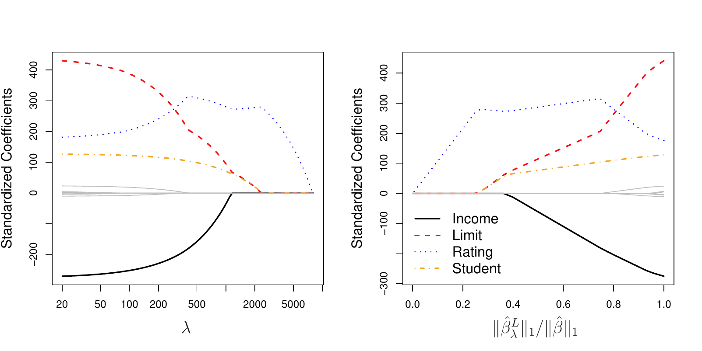
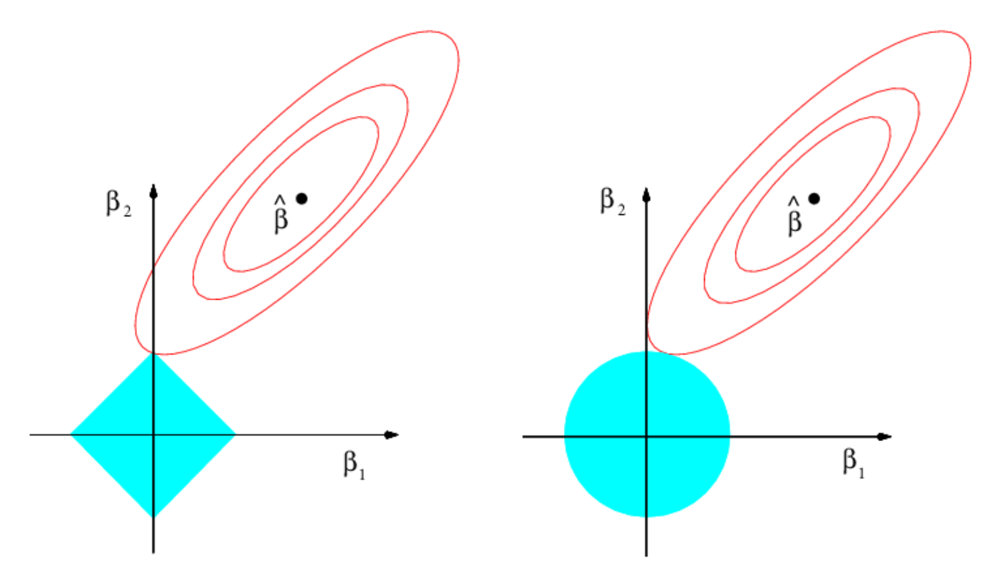
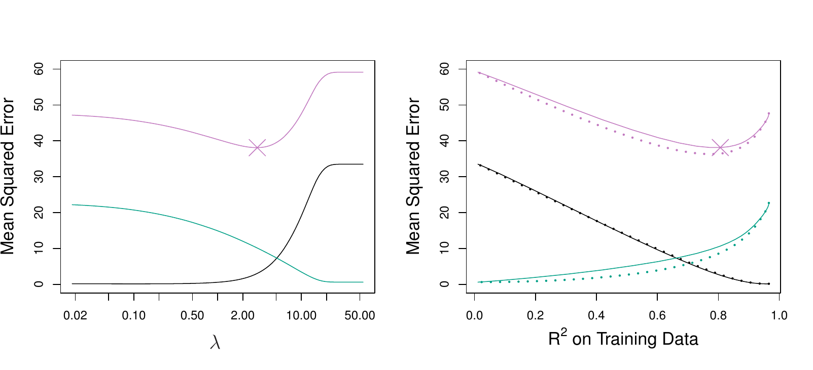
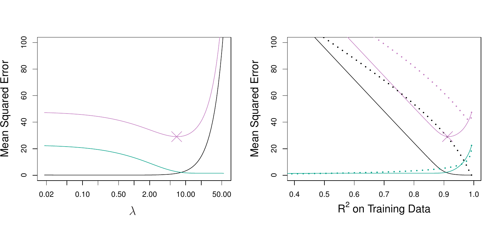

```{python}
#| label: setup
#| include: false
import numpy as np
import pandas as pd
import matplotlib.pyplot as plt
from iterative_latex import iterative_latex
plt.style.use("sta363.mplstyle")
rng = np.random.default_rng(363)
```

## Review

::: {.question}
What is ridge regression minimizing, and what is $\hat\beta^R$?
:::

::: {.fragment}
::: {.takeaway}
RSS $+ \lambda\sum_{j=1}^p\beta_j^2$, minimized by
$(\mathbf{X}^T\mathbf{X} + \lambda\mathbf{I})^{-1}\mathbf{X}^T\mathbf{y}$.
:::
:::

## What ridge cannot do {.small}

::: {.takeaway}
Ridge keeps all $p$ predictors in the model at every finite $\lambda$. On
`Credit` that is ten coefficients to report when four of them carry the signal.
:::

::: {.fragment}
::: {.question}
Subset selection drops predictors and ridge shrinks them. Is there something
that does both?
:::
:::

# The lasso {.center}

```{python}
#| output: asis
#| echo: false
iterative_latex(
    "The lasso",
    r"\sum_{i=1}^{n}\left(y_i - \beta_0 - \sum_{j=1}^{p}\beta_jx_{ij}\right)^2 + \lambda\sum_{j=1}^{p}|\beta_j|",
    small=True,
    highlights=[
        r"|\beta_j|",
        r"\sum_{j=1}^{p}|\beta_j|",
        r"\lambda",
    ],
    explanations=[
        "The absolute value of one coefficient, where ridge had its square. That is the whole difference between the two methods.",
        "Summed over the $p$ predictors, this is the $\\ell_1$ norm $\\|\\beta\\|_1$, where ridge used the squared $\\ell_2$ norm $\\|\\beta\\|_2^2$. The sum starts at $j = 1$, so the intercept goes unpenalized here too.",
        "The same tuning parameter, chosen the same way, by cross-validation. At $\\lambda = 0$ this is least squares, and at $\\lambda$ large enough every coefficient is exactly zero.",
    ],
)
```

## Two norms {.small}

:::: {.columns}

::: {.column width="50%"}
### Ridge

$$\|\beta\|_2^2 = \sum_{j=1}^{p}\beta_j^2$$

Shrinks every coefficient toward zero.
:::

::: {.column width="50%"}
### Lasso

$$\|\beta\|_1 = \sum_{j=1}^{p}|\beta_j|$$

Shrinks, and sets some to exactly zero.
:::

::::

::: {.fragment}
::: {.takeaway}
A model with some coefficients exactly zero is called **sparse**. The lasso
performs variable selection as a side effect of shrinking.
:::
:::

## Lasso paths on Credit

{fig-align="center" width="88%"}

::: {.source}
ISLP Figure 6.6. Standardized lasso coefficients for `Credit` against $\lambda$
on the left and against $\|\hat\beta^L_\lambda\|_1 / \|\hat\beta\|_1$ on the
right.
:::


## Application exercise

::: {.takeaway}
Complete Part 1. [ex/10-ex](../ex/10-ex.qmd)
:::

# Why the lasso zeroes out {.center}

## The budget form {.small}

:::: {.columns}

::: {.column width="50%"}
### Lasso

minimize RSS subject to
$$\sum_{j=1}^{p}|\beta_j| \leq s$$
:::

::: {.column width="50%"}
### Ridge

minimize RSS subject to
$$\sum_{j=1}^{p}\beta_j^2 \leq s$$
:::

::::

::: {.fragment}
::: {.takeaway}
For every $\lambda$ there is an $s$ giving the same answer. Large $\lambda$ is
a small budget.
:::
:::

## The constraint regions

{fig-align="center" width="66%"}

::: {.source}
ISLP Figure 6.7. Contours of RSS in red against the constraint regions in blue:
a diamond for the lasso on the left, a circle for ridge on the right.
:::

## Corners {.small}

::: {.takeaway}
The RSS contours grow outward from $\hat\beta$ until they touch the constraint
region. The diamond has corners on the axes, and a corner is a point where one
coefficient is exactly zero.
:::

::: {.fragment}
::: {.question}
A circle has no corners. Where does the ridge solution touch, and what does
that mean for a coefficient reaching zero?
:::
:::

# Which one wins {.center}

## A dense truth

{fig-align="center" width="88%"}

::: {.source}
ISLP Figure 6.8. All 45 predictors related to the response. Right: lasso solid,
ridge dotted, with squared bias, variance, and test MSE.
:::

## A sparse truth

{fig-align="center" width="88%"}

::: {.source}
ISLP Figure 6.9. The same simulation with only two predictors related to the
response. Lasso solid, ridge dotted.
:::

::: {.fragment}
::: {.takeaway}
Neither method dominates. The lasso wins when the truth is sparse, and ridge
wins when every predictor contributes a little.
:::
:::

## You cannot see the truth {.small}

::: {.question}
On a real data set, how would you decide between them?
:::

::: {.fragment}
::: {.takeaway}
Cross-validate both and compare, exactly as with any other choice this
semester. The choice of method is one more tuning decision.
:::
:::

## Application exercise

::: {.takeaway}
Complete Parts 2, 3 and 4. [ex/10-ex](../ex/10-ex.qmd)
:::

# Elastic net {.center}

```{python}
#| output: asis
#| echo: false
iterative_latex(
    "Elastic net",
    r"\text{RSS} + \lambda\left(\alpha\sum_{j=1}^{p}|\beta_j| + (1-\alpha)\sum_{j=1}^{p}\beta_j^2\right)",
    small=True,
    highlights=[
        r"\alpha\sum_{j=1}^{p}|\beta_j|",
        r"(1-\alpha)\sum_{j=1}^{p}\beta_j^2",
        r"\alpha",
    ],
    explanations=[
        "The lasso part of the penalty, which is what drives coefficients to exactly zero and makes the fit sparse.",
        "The ridge part, which shrinks everything and handles correlated predictors without having to choose between them.",
        "The mixing parameter, between 0 and 1. At $\\alpha = 1$ this is the lasso and at $\\alpha = 0$ it is ridge. It is scikit-learn's `l1_ratio`, and it is tuned by cross-validation alongside $\\lambda$.",
    ],
)
```

## When mixing helps {.small}

::: {.incremental}
* The lasso picks one of a group of correlated predictors and drops the rest  
* When $p > n$ the lasso can select at most $n$ predictors  
* The ridge part lifts both limits while the lasso part keeps the sparsity  
:::

# In Python {.center}

## Lasso in scikit-learn {.small}

```{python}
DATA = "https://raw.githubusercontent.com/LucyMcGowan/sta-363-f26/main/data/"
from sklearn.linear_model import Lasso  # <1>
from sklearn.preprocessing import StandardScaler
from sklearn.pipeline import make_pipeline

Hitters = pd.read_csv(DATA + "Hitters.csv").dropna(subset=["Salary"])
X = pd.get_dummies(Hitters.drop(columns=["Salary"]), drop_first=True).astype(float)
y = Hitters["Salary"]

fit = make_pipeline(StandardScaler(), Lasso(alpha=70, max_iter=200000)).fit(X, y)  # <2>
pd.Series(fit[-1].coef_, index=X.columns).loc[lambda s: s != 0].round(1)  # <3>
```
1. `Lasso` is scikit-learn's $\ell_1$ penalized least squares. Its penalty  
   parameter is `alpha`, the same name `Ridge` uses.
2. `max_iter=200000` raises the iteration cap on the coordinate descent solver,  
   since the lasso has no closed form the way ridge does and small `alpha`
   values converge slowly.
3. `.loc[lambda s: s != 0]` keeps only the nonzero coefficients, which is the  
   part of the output the lasso is being asked for.

## Tuning alpha {.small}

```{python}
from sklearn.model_selection import GridSearchCV, KFold

cv = KFold(n_splits=10, shuffle=True, random_state=363)
grid = GridSearchCV(
    make_pipeline(StandardScaler(), Lasso(max_iter=200000)),
    {"lasso__alpha": np.logspace(-1, 3, 60)},  # <1>
    cv=cv, scoring="neg_mean_squared_error",
).fit(X, y)

kept = int((grid.best_estimator_[-1].coef_ != 0).sum())  # <2>
round(grid.best_params_["lasso__alpha"], 2), round(-grid.best_score_), kept
```
1. Sixty candidate penalties on a log scale from 0.1 to 1000, reaching the  
   `alpha` of the pipeline step named `lasso`.
2. `grid.best_estimator_` is the pipeline refit on all the data at the winning  
   `alpha`, so counting its nonzero coefficients says how many predictors the
   chosen model actually uses.

::: {.fragment}
::: {.question}
The winning alpha keeps 17 of 19. Where did the sparsity go?
:::
:::

## The one standard error rule {.small}

```{python}
#| echo: false
#| fig-align: center
res = pd.DataFrame(grid.cv_results_)
a = res["param_lasso__alpha"].astype(float).values
m = -res["mean_test_score"].values
se = res["std_test_score"].values / np.sqrt(10)

best = int(m.argmin())
thresh = m[best] + se[best]
pick = float(a[m <= thresh].max())

fig, ax = plt.subplots(figsize=(7.2, 3.4))
ax.errorbar(a, m, yerr=se, fmt="-o", color="#d5008f", ms=3, lw=1.3,
            ecolor="#eec8e1", capsize=2)
ax.axhline(thresh, color="#595959", ls="--", lw=1)
ax.axvline(pick, color="#007c86", lw=1.2)
ax.set_xscale("log")
ax.set_xlabel("alpha")
ax.set_ylabel("10-fold CV MSE")
plt.show()
```

::: {.source}
The lasso CV curve on `Hitters`. Dashed line: one standard error above the
minimum. Vertical line: the largest alpha still under it.
:::

## What the rule keeps {.small}

```{python}
one_se = make_pipeline(StandardScaler(), Lasso(alpha=pick, max_iter=200000)).fit(X, y)  # <1>
pd.Series(one_se[-1].coef_, index=X.columns).loc[lambda s: s != 0].round(1)
```
1. `pick` is the largest `alpha` whose cross-validated MSE sits within one  
   standard error of the minimum, read off the curve on the previous slide.
   Refitting there gives the model the one standard error rule chooses.

::: {.fragment}
::: {.takeaway}
Six predictors instead of seventeen, at a cross-validated MSE the folds cannot
distinguish from the best one.
:::
:::

## ElasticNet in scikit-learn {.small}

```{python}
from sklearn.linear_model import ElasticNet  # <1>

enet = GridSearchCV(
    make_pipeline(StandardScaler(), ElasticNet(max_iter=200000)),
    {
        "elasticnet__alpha": np.logspace(-1, 3, 30),
        "elasticnet__l1_ratio": [0.1, 0.3, 0.5, 0.7, 0.9, 1.0],  # <2>
    },
    cv=cv, scoring="neg_mean_squared_error",
).fit(X, y)

enet.best_params_, round(-enet.best_score_)  # <3>
```
1. `ElasticNet` carries both penalties at once, with `alpha` setting the total  
   strength and `l1_ratio` splitting it between the two.
2. `l1_ratio` is the $\alpha$ from the equation above: 1.0 is pure lasso, 0.0  
   is pure ridge, and the grid searches six points between them.
3. The search runs 180 combinations per fold, and `best_params_` reports the  
   winning pair.

::: {.fragment}
::: {.question}
`l1_ratio` comes back at 1.0. What does that say about `Hitters`?
:::
:::

## Application exercise

::: {.takeaway}
Complete Part 5. [ex/10-ex](../ex/10-ex.qmd)
:::
